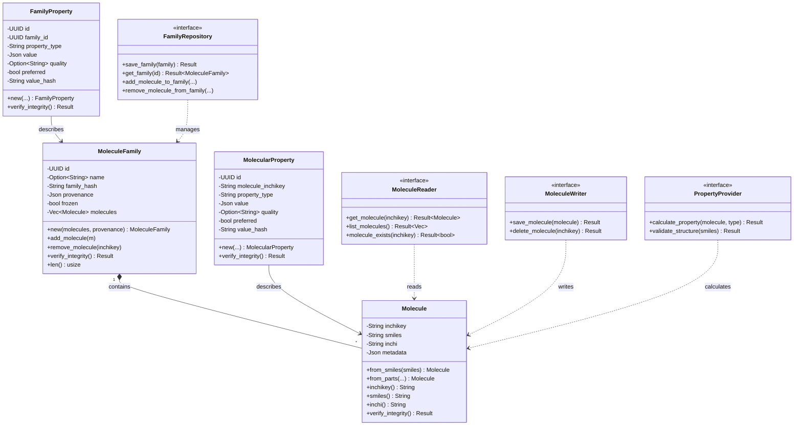
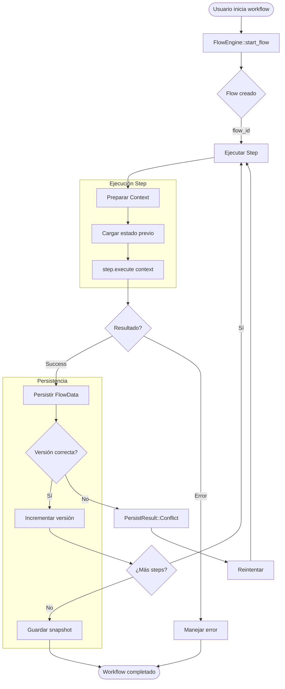
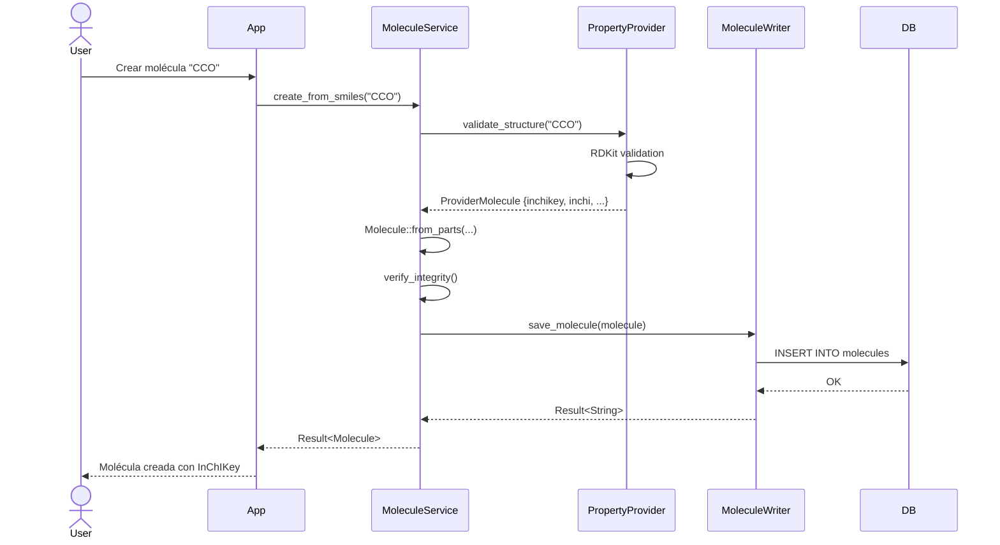
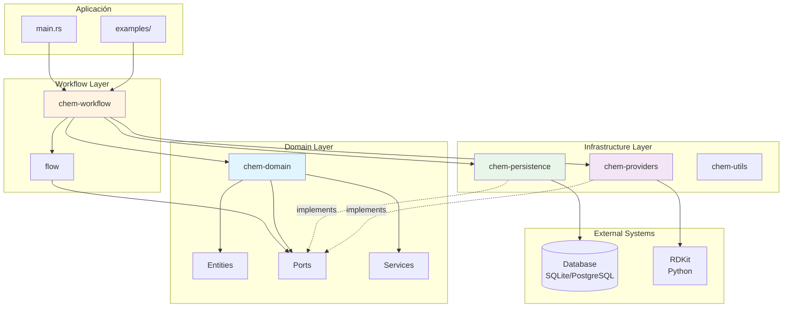

# Guía de Entendimiento del Proyecto flow-chem

## 📋 Índice

1. [Visión General del Sistema](#visión-general-del-sistema)
2. [Orden de Lectura y Análisis](#orden-de-lectura-y-análisis)
3. [Arquitectura del Sistema](#arquitectura-del-sistema)
4. [Diagramas Técnicos](#diagramas-técnicos)
5. [Conceptos Clave](#conceptos-clave)
6. [Flujo de Datos](#flujo-de-datos)

---

## 🎯 Visión General del Sistema

**flow-chem** es una plataforma modular en Rust para modelar, versionar y persistir flujos de trabajo químicos con entidades moleculares, familias y propiedades, garantizando trazabilidad e integridad de datos.

### Propósito Principal

- **Gestión de entidades químicas**: Moléculas, familias moleculares y propiedades
- **Flujos de trabajo versionados**: Sistema de ramificación y snapshots para trazabilidad
- **Integración con motores químicos**: RDKit para cálculos y validaciones
- **Persistencia flexible**: SQLite (desarrollo/tests) y PostgreSQL (producción)

### Tecnologías Principales

- **Lenguaje**: Rust (edition 2021)
- **Base de datos**: Diesel ORM (SQLite/PostgreSQL)
- **Motor químico**: RDKit (vía PyO3 - Python binding)
- **Arquitectura**: Hexagonal (Ports & Adapters)
- **Testing**: Repositorios en memoria + Docker para integración

---

## 📚 Orden de Lectura y Análisis

### Fase 1: Configuración y Contexto

**Objetivo**: Comprender el ecosistema del proyecto

1. **`/Cargo.toml`** (raíz)

   - Workspace structure y dependencias compartidas
   - Features flags (mock_rdkit, testing, pg_demo)
   - Entender el sistema de crates

2. **`/README.md`**

   - Arquitectura general
   - Comandos de desarrollo
   - Flujo de trabajo recomendado

3. **`/docker-compose.yml`** y **`/Dockerfile`**

   - Servicios (db, app-dev, app)
   - Variables de entorno clave
   - Setup de RDKit y Python

4. **`/docs/architecture_current.md`** y **`/docs/architecture_target.md`**
   - Evolución del diseño
   - Decisiones arquitectónicas

### Fase 2: Core Domain

**Objetivo**: Entender las entidades y reglas de negocio

5. **`/crates/chem-domain/Cargo.toml`**

   - Dependencias del dominio
   - Features y configuración

6. **`/crates/chem-domain/src/lib.rs`**

   - Estructura del módulo
   - Exports públicos
   - Organización ports/services

7. **`/crates/chem-domain/src/molecule.rs`**

   - Entidad central: Molecule
   - Invariantes y validaciones
   - InChIKey como identificador único

8. **`/crates/chem-domain/src/molecule_family.rs`**

   - Agrupación de moléculas
   - Hash de familia para integridad
   - Operaciones de add/remove

9. **`/crates/chem-domain/src/molecular_property.rs`** y **`family_property.rs`**

   - Sistema de propiedades
   - Calidad y preferencia
   - Hash de valores

10. **`/crates/chem-domain/src/errors.rs`**
    - Tipos de error del dominio
    - Manejo con thiserror

### Fase 3: Ports & Adapters

**Objetivo**: Comprender las interfaces del sistema

11. **`/crates/chem-domain/src/ports/mod.rs`**

    - Trait definitions
    - Separación de responsabilidades

12. **`/crates/chem-domain/src/ports/molecule_reader.rs`** y **`molecule_writer.rs`**

    - Segregación de interfaces (ISP)
    - Operaciones CRUD

13. **`/crates/chem-domain/src/ports/family_repository.rs`**

    - Gestión de familias
    - Relaciones molecule-family

14. **`/crates/chem-domain/src/ports/property_provider.rs`** y **`property_repository.rs`**
    - Cálculo de propiedades
    - Persistencia de propiedades

### Fase 4: Services

**Objetivo**: Lógica de negocio

15. **`/crates/chem-domain/src/services/mod.rs`**

    - MoleculeService
    - FamilyService

16. **`/crates/chem-domain/src/application/`** (si existe)
    - Use cases
    - Casos de uso de aplicación

### Fase 5: Flow Engine

**Objetivo**: Sistema de versionado y flujos

17. **`/crates/flow/src/lib.rs`**

    - Concepto de Flow
    - Arquitectura de eventos

18. **`/crates/flow/src/domain.rs`**

    - FlowData y FlowMeta
    - WorkItem y cursor
    - Snapshots

19. **`/crates/flow/src/repository.rs`**

    - Trait FlowRepository
    - Operaciones de persistencia
    - Locking optimista

20. **`/crates/flow/src/stubs.rs`**

    - InMemoryFlowRepository
    - Útil para entender el contrato

21. **`/crates/flow/tests/repo_inmemory.rs`**
    - Casos de uso reales
    - Ramificación y prunning

### Fase 6: Persistencia

**Objetivo**: Implementación de almacenamiento

22. **`/crates/chem-persistence/Cargo.toml`**

    - Diesel setup
    - Features sqlite/postgres

23. **`/crates/chem-persistence/src/schema.rs`**

    - Estructura de tablas
    - Relaciones

24. **`/crates/chem-persistence/migrations/`**

    - Evolución del schema
    - Migraciones Diesel

25. **`/crates/chem-persistence/src/domain_persistence.rs`**

    - Implementación de DomainRepository
    - Mapeo entidad-tabla

26. **`/crates/chem-persistence/src/flow_persistence.rs`**

    - Implementación de FlowRepository
    - Gestión de versiones

27. **`/crates/chem-persistence/tests/`**
    - Tests de integración
    - Validación de invariantes

### Fase 7: Providers

**Objetivo**: Integración con sistemas externos

28. **`/crates/chem-providers/Cargo.toml`**

    - PyO3 configuration
    - Python dependencies

29. **`/crates/chem-providers/python/rdkit_wrapper.py`**

    - Funciones RDKit expuestas
    - Cálculos químicos

30. **`/crates/chem-providers/src/core.rs`**
    - Binding Rust-Python
    - ChemEngine trait

### Fase 8: Workflows

**Objetivo**: Flujos de trabajo químicos

31. **`/crates/chem-workflow/src/lib.rs`**

    - WorkflowType y ChemicalFlowEngine

32. **`/crates/chem-workflow/src/engine/chemical_flow.rs`**

    - Motor de ejecución
    - Integración flow + domain + providers

33. **`/crates/chem-workflow/src/flows/cadma_flow/`**

    - Flujo CADMA completo
    - Steps 1-5

34. **`/crates/chem-workflow/src/step/`**

    - Trait WorkflowStep
    - Context y constantes

35. **`/crates/chem-workflow/examples/cadma_example.rs`**
    - Uso end-to-end
    - Menú interactivo

### Fase 9: Testing & CI/CD

**Objetivo**: Estrategia de pruebas

36. **`/scripts/`**

    - generate_coverage.sh
    - run_tests_in_docker.sh
    - run_sonar.sh

37. **Tests en cada crate**
    - Patrón Given-When-Then
    - Mocks vs integración

### Fase 10: Entrada Principal

**Objetivo**: Punto de inicio de la aplicación

38. **`/src/main.rs`**

    - Inicialización
    - Ejemplo de uso

39. **`/examples/`**
    - Casos de uso completos

---

## 🏛️ Arquitectura del Sistema

### Arquitectura Hexagonal (Ports & Adapters)

```
┌─────────────────────────────────────────────────────────────┐
│                         APLICACIÓN                           │
│                     (src/main.rs)                            │
└────────────────────┬─────────────────────────────────────────┘
                     │
        ┌────────────┴─────────────┐
        │                          │
        ▼                          ▼
┌──────────────┐          ┌──────────────┐
│ chem-workflow│          │    flow      │
│   (Engine)   │          │  (Engine)    │
└──────┬───────┘          └──────┬───────┘
       │                         │
       │ usa                     │ usa
       ▼                         ▼
┌──────────────────────────────────────┐
│         chem-domain                  │
│      (Core Business Logic)           │
│  ┌────────────────────────────────┐  │
│  │ Entities (Molecule, Family)    │  │
│  │ Value Objects (Properties)     │  │
│  │ Domain Services                │  │
│  └────────────────────────────────┘  │
│  ┌────────────────────────────────┐  │
│  │ Ports (Interfaces)             │  │
│  │ - MoleculeReader/Writer        │  │
│  │ - FamilyRepository             │  │
│  │ - PropertyProvider             │  │
│  │ - PropertyRepository           │  │
│  └────────────────────────────────┘  │
└──────────────────────────────────────┘
         ▲                        ▲
         │                        │
    implements              implements
         │                        │
┌────────┴────────┐      ┌───────┴──────────┐
│ chem-persistence│      │  chem-providers  │
│   (Adapters)    │      │   (Adapters)     │
│                 │      │                  │
│ - Diesel ORM    │      │ - RDKit (PyO3)   │
│ - SQLite/PG     │      │ - Python wrapper │
└─────────────────┘      └──────────────────┘
```

### Principios SOLID Aplicados

1. **Single Responsibility (SRP)**

   - Cada crate tiene una responsabilidad clara
   - Separación domain/persistence/providers

2. **Open/Closed (OCP)**

   - Extensible vía traits (Ports)
   - Features flags para configuración

3. **Liskov Substitution (LSP)**

   - Implementaciones intercambiables de repositorios
   - InMemory vs Diesel

4. **Interface Segregation (ISP)**

   - MoleculeReader separado de MoleculeWriter
   - Ports granulares

5. **Dependency Inversion (DIP)**
   - Domain no depende de implementaciones concretas
   - Inversión mediante traits

---

## 📊 Diagramas Técnicos

### Diagrama de Clases - Dominio Químico



### Diagrama de Flujo - Sistema de Flows



### Diagrama de Secuencia - Creación de Molécula



### Diagrama de Componentes - Crates



---

## 🔑 Conceptos Clave

### 1. InChIKey como Identificador

- **Único e invariante** para cada estructura molecular
- Generado por RDKit
- Usado como clave primaria en `molecules`

### 2. Flow Versionado

- **Cursor**: posición en el flujo (step_number)
- **Version**: contador de cambios (optimistic locking)
- **Branching**: crear ramas desde un cursor
- **Snapshot**: punto de guardado completo

### 3. FlowData - Event Sourcing

- Cada cambio es un registro inmutable
- Reconstrucción del estado mediante replay
- `command_id` para idempotencia

### 4. Ports & Adapters

- **Port**: trait que define una interfaz (ej: `MoleculeReader`)
- **Adapter**: implementación concreta (ej: `DieselDomainRepository`)
- Domain nunca depende de adapters

### 5. Property System

- **MolecularProperty**: propiedad de una molécula individual
- **FamilyProperty**: propiedad agregada de una familia
- **Quality**: metadata sobre la calidad del cálculo
- **Preferred**: flag para múltiples valores

### 6. Workflow Steps

- **Context**: estado compartido entre steps
- **Input/Output**: tipos específicos por step
- **Payload**: resultado serializable del step
- **Metadata**: información auxiliar (warnings, stats)

---

## 🌊 Flujo de Datos

### Flujo de Creación de Molécula

```
Usuario (SMILES)
    ↓
MoleculeService::create_from_smiles()
    ↓
PropertyProvider::validate_structure() [RDKit]
    ↓
Molecule::from_parts() + verify_integrity()
    ↓
MoleculeWriter::save_molecule()
    ↓
DieselRepository → INSERT INTO molecules
    ↓
Base de Datos
```

### Flujo de Ejecución de Workflow

```
ChemicalFlowEngine::start_workflow()
    ↓
FlowEngine::start_flow()
    ↓
Loop sobre Steps:
    ↓
    Step::prepare_context()
        ↓ (carga datos previos)
    Step::execute()
        ↓ (lógica del step)
    Step::persist_result()
        ↓ (guarda FlowData)
    FlowRepository::persist_data()
        ↓ (optimistic lock)
    Incrementar version
    ↓
Snapshot final
    ↓
Workflow completado
```

### Flujo de Rehidratación

```
Usuario solicita continuar workflow
    ↓
FlowRepository::load_latest_snapshot(flow_id)
    ↓
Deserializar snapshot → Estado parcial
    ↓
FlowRepository::read_data(flow_id, desde_cursor)
    ↓
Replay FlowData eventos → Estado completo
    ↓
ChemicalFlowEngine reconstruido
    ↓
Continuar ejecución
```

---

## ✅ Checklist de Entendimiento

Marca cuando hayas comprendido cada sección:

- [ ] Entiendo la estructura del workspace (Cargo.toml raíz)
- [ ] Comprendo las entidades del dominio (Molecule, Family, Properties)
- [ ] Entiendo el patrón Ports & Adapters aplicado
- [ ] Comprendo el sistema de Flows y versionado
- [ ] Entiendo la persistencia con Diesel
- [ ] Comprendo la integración con RDKit
- [ ] Entiendo los workflows (CADMA flow)
- [ ] Comprendo el sistema de steps
- [ ] Entiendo el flujo de datos completo
- [ ] Puedo ejecutar tests localmente
- [ ] Puedo ejecutar el proyecto en Docker
- [ ] Comprendo las estrategias de testing

---

## 🎓 Notas de Aprendizaje

### Puntos de Atención

1. **Features flags**: Controlan mock_rdkit, sqlite vs postgres
2. **Error handling**: Uso de `thiserror` y tipos Result personalizados
3. **Async**: Tokio usado principalmente en tests
4. **Serialización**: serde_json para payloads y metadata
5. **Hashing**: SHA-256 para integrity checks

### Patrones de Código Comunes

- Constructor pattern: `::new()` y `::from_*()`
- Builder pattern: modificadores fluidos
- Result unwrapping: uso de `?` operator
- Trait bounds: `T: MoleculeReader + Send + Sync`

### Convenciones

- Prefijos `Owned*` para structs con ownership completo
- Sufijos `*Repository`, `*Provider`, `*Service`
- Keys de FlowData: `step_state:{step_name}`
- Test naming: `test_{scenario}_should_{expected_behavior}`

---

**Última actualización**: Octubre 2025
**Versión del proyecto**: 0.1.0
**Mantenedor**: flow-chem team
