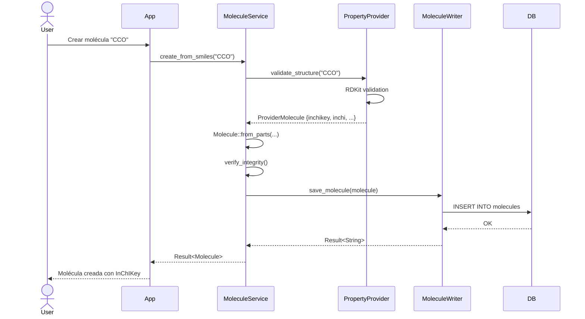
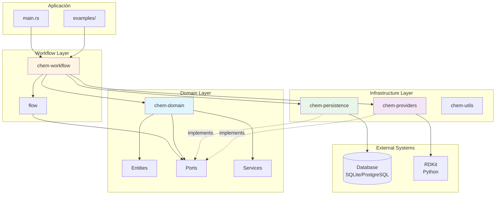

# Guía de Entendimiento del Proyecto flow-chem
## 📋 Índice
1. [Visión General del Sistema](#visión-general-del-sistema)
2. [Orden de Lectura y Análisis](#orden-de-lectura-y-análisis)
3. [Arquitectura del Sistema](#arquitectura-del-sistema)
4. [Diagramas Técnicos](#diagramas-técnicos)
5. [Conceptos Clave](#conceptos-clave)
6. [Flujo de Datos](#flujo-de-datos)
---
## 🎯 Visión General del Sistema
**flow-chem** es una plataforma modular en Rust para modelar, versionar y persistir flujos de trabajo químicos con entidades moleculares, familias y propiedades, garantizando trazabilidad e integridad de datos.
### Propósito Principal
- **Gestión de entidades químicas**: Moléculas, familias moleculares y propiedades
- **Flujos de trabajo versionados**: Sistema de ramificación y snapshots para trazabilidad
- **Integración con motores químicos**: RDKit para cálculos y validaciones
- **Persistencia flexible**: SQLite (desarrollo/tests) y PostgreSQL (producción)
### Tecnologías Principales
- **Lenguaje**: Rust (edition 2021)
- **Base de datos**: Diesel ORM (SQLite/PostgreSQL)
- **Motor químico**: RDKit (vía PyO3 - Python binding)
- **Arquitectura**: Hexagonal (Ports & Adapters)
- **Testing**: Repositorios en memoria + Docker para integración
---
## 📚 Orden de Lectura y Análisis
### Fase 1: Configuración y Contexto
**Objetivo**: Comprender el ecosistema del proyecto
1. **`/Cargo.toml`** (raíz)
   - Workspace structure y dependencias compartidas
   - Features flags (mock_rdkit, testing, pg_demo)
   - Entender el sistema de crates
2. **`/README.md`**
   - Arquitectura general
   - Comandos de desarrollo
   - Flujo de trabajo recomendado
3. **`/docker-compose.yml`** y **`/Dockerfile`**
   - Servicios (db, app-dev, app)
   - Variables de entorno clave
   - Setup de RDKit y Python
4. **`/docs/architecture_current.md`** y **`/docs/architecture_target.md`**
   - Evolución del diseño
   - Decisiones arquitectónicas
### Fase 2: Core Domain
**Objetivo**: Entender las entidades y reglas de negocio
5. **`/crates/chem-domain/Cargo.toml`**
   - Dependencias del dominio
   - Features y configuración
   
   💡 **Qué buscar**: Fíjate en las dependencias `serde`, `uuid`, `sha2` que son fundamentales para serialización, identificadores y hashing respectivamente.
6. **`/crates/chem-domain/src/lib.rs`**
   - Estructura del módulo
   - Exports públicos
   - Organización ports/services
   
   💡 **Qué buscar**: Este archivo es como el "índice" del dominio. Observa cómo se re-exportan los tipos principales (`Molecule`, `MoleculeFamily`) y cómo están organizados los módulos (`ports/`, `services/`, `application/`). Es el mapa de todo el crate.
7. **`/crates/chem-domain/src/molecule.rs`** ⭐ **CLAVE**
   - Entidad central: Molecule
   - Invariantes y validaciones
   - InChIKey como identificador único
   
   💡 **Qué buscar aquí**:
   - **Línea ~30-50**: El struct `Molecule` con sus campos (`inchikey`, `smiles`, `inchi`, `metadata`). Nota que `inchikey` es el ID único inmutable.
   - **Método `from_parts()` (línea ~80-100)**: Constructor principal. Observa cómo NO valida la estructura química, solo ensambla los campos. Esto es importante: asume que los datos ya son válidos.
   - **Método `from_smiles()` (línea ~120-140)**: Este SÍ delega validación al `PropertyProvider`. Nota la diferencia: aquí se genera la molécula desde cero.
   - **Método `verify_integrity()` (línea ~200-220)**: Recalcula el hash del InChIKey para verificar que no hubo corrupción. Es un patrón de validación defensiva.
   - **Serialización**: Fíjate en los derives `Serialize`, `Deserialize` - esto permite persistir la molécula en JSON/BD.
   
   🔍 **Percátate**: La molécula se construye de dos formas: 1) Con validación completa via RDKit (`from_smiles`), o 2) Con datos pre-validados (`from_parts`). Esto es un patrón común: constructores "seguros" vs "de confianza".
8. **`/crates/chem-domain/src/molecule_family.rs`** ⭐ **CLAVE**
   - Agrupación de moléculas
   - Hash de familia para integridad
   - Operaciones de add/remove
   
   💡 **Qué buscar aquí**:
   - **Struct `MoleculeFamily` (línea ~20-35)**: Observa el campo `family_hash` - es crucial para detectar cambios en la familia.
   - **Campo `frozen` (línea ~30)**: Flag boolean que impide modificaciones. Es un patrón de inmutabilidad opcional.
   - **Método `new()` (línea ~50-80)**: Constructor que calcula el hash inicial. Nota cómo concatena los InChIKeys de todas las moléculas + el provenance y luego hashea todo con SHA-256.
   - **Métodos `add_molecule()` / `remove_molecule()` (línea ~120-180)**: Observa que RECALCULAN el hash después de cada operación. Esto garantiza trazabilidad.
   - **Método `verify_integrity()` (línea ~200-220)**: Similar a Molecule, verifica que el hash siga siendo correcto.
   
   🔍 **Percátate**: El `family_hash` es como una "firma digital" de la familia. Si alguien modifica las moléculas o el provenance, el hash cambia. Esto es fundamental para auditoría y trazabilidad química.
9. **`/crates/chem-domain/src/molecular_property.rs`** y **`family_property.rs`**
   - Sistema de propiedades
   - Calidad y preferencia
   - Hash de valores
   
   💡 **Qué buscar aquí**:
   - **`MolecularProperty` (línea ~15-30)**: Campos `property_type` (ej: "molecular_weight"), `value` (JSON), `quality` (opcional), `preferred` (boolean), `value_hash`.
   - **`value_hash` (línea ~60-80)**: Similar al patrón anterior - hashea el tipo + valor para integridad.
   - **Campo `preferred` (línea ~25)**: Permite marcar cuál valor es el "oficial" cuando hay múltiples cálculos de la misma propiedad.
   - **`FamilyProperty`**: Estructura idéntica pero para familias completas (ej: "average_molecular_weight" de toda la familia).
   
   🔍 **Percátate**: Las propiedades son "extensiones" de las entidades. No modifican Molecule/Family, sino que viven en tablas separadas. Esto sigue el principio de separación de concerns.
10. **`/crates/chem-domain/src/errors.rs`**
    - Tipos de error del dominio
    - Manejo con thiserror
    
    💡 **Qué buscar**: Enum `DomainError` con variantes como `InvalidInChIKey`, `MoleculeNotFound`, `FamilyFrozen`. Observa el uso de `#[error("...")]` macro de thiserror para mensajes descriptivos. Este patrón hace que los errores sean type-safe y autodocumentados.
### Fase 3: Ports & Adapters
**Objetivo**: Comprender las interfaces del sistema
11. **`/crates/chem-domain/src/ports/mod.rs`** ⭐ **ARQUITECTURA CLAVE**
    - Trait definitions
    - Separación de responsabilidades
    
    💡 **Qué buscar**: Este archivo define el "contrato" entre el dominio y el mundo exterior. Los traits son interfaces puras sin implementación.
    
    🔍 **Percátate**: El patrón "Ports" significa que el dominio NO conoce bases de datos, APIs externas, etc. Solo conoce interfaces. Esto permite cambiar la implementación (SQLite → PostgreSQL) sin tocar el dominio.
12. **`/crates/chem-domain/src/ports/molecule_reader.rs`** y **`molecule_writer.rs`** ⭐ **PATRÓN ISP**
    - Segregación de interfaces (ISP - Interface Segregation Principle)
    - Operaciones CRUD
    
    💡 **Qué buscar aquí**:
    - **`MoleculeReader` trait (línea ~10-30)**: Métodos solo de lectura: `get_molecule()`, `list_molecules()`, `molecule_exists()`. Todos retornan `Result<T>`.
    - **`MoleculeWriter` trait (línea ~35-50)**: Métodos solo de escritura: `save_molecule()`, `delete_molecule()`.
    
    🔍 **Percátate**: Están SEPARADOS. Un código que solo necesita leer moléculas no tiene por qué implementar escritura. Esto es ISP en acción: interfaces pequeñas y enfocadas. Por ejemplo, un servicio de reportes solo necesitaría `MoleculeReader`.
13. **`/crates/chem-domain/src/ports/family_repository.rs`**
    - Gestión de familias
    - Relaciones molecule-family
    
    💡 **Qué buscar aquí**:
    - **Métodos de agregación (línea ~40-70)**: `add_molecule_to_family()`, `remove_molecule_from_family()`. Nota que NO modifican el dominio directamente - eso es trabajo del servicio.
    - **Query methods (línea ~20-40)**: `get_family()`, `list_families()`, `get_family_molecules()`.
    
    🔍 **Percátate**: Este trait combina lectura y escritura porque las familias son agregados más complejos que moléculas individuales. Es una decisión pragmática vs purista.
14. **`/crates/chem-domain/src/ports/property_provider.rs`** y **`property_repository.rs`** ⭐ **INTEGRACIÓN EXTERNA**
    - Cálculo de propiedades
    - Persistencia de propiedades
    
    💡 **Qué buscar aquí**:
    - **`PropertyProvider` trait (property_provider.rs, línea ~10-40)**: Este es el trait que abstrae RDKit. Métodos como `validate_structure()`, `calculate_property()`. Nota que retorna tipos del dominio (`ProviderMolecule`), NO tipos de RDKit.
    - **`PropertyRepository` trait (property_repository.rs, línea ~10-50)**: Similar a los otros repositorios pero para propiedades. Métodos: `save_property()`, `get_properties_for_molecule()`, etc.
    
    🔍 **Percátate**: `PropertyProvider` es especial - es el ÚNICO punto de contacto con el motor químico (RDKit). Esto significa que podrías cambiar RDKit por otro motor (ej: OpenBabel) implementando este trait sin tocar nada más del dominio.
### Fase 4: Services
**Objetivo**: Lógica de negocio
15. **`/crates/chem-domain/src/services/mod.rs`**
    - MoleculeService
    - FamilyService
16. **`/crates/chem-domain/src/application/`** (si existe)
    - Use cases
    - Casos de uso de aplicación
### Fase 5: Flow Engine
**Objetivo**: Sistema de versionado y flujos
17. **`/crates/flow/src/lib.rs`**
    - Concepto de Flow
    - Arquitectura de eventos
    
    💡 **Qué buscar**: Exports de `FlowData`, `FlowMeta`, `FlowRepository`. Este crate es independiente del dominio químico - es un motor genérico de flujos versionados.
18. **`/crates/flow/src/domain.rs`** ⭐ **EVENT SOURCING**
    - FlowData y FlowMeta
    - WorkItem y cursor
    - Snapshots
    
    💡 **Qué buscar aquí**:
    - **Struct `FlowData` (línea ~20-40)**: Esta es la unidad fundamental. Cada registro es INMUTABLE y representa un "evento" en el flujo. Campos clave:
      - `flow_id`: identificador del flujo
      - `cursor`: posición secuencial (0, 1, 2, 3...)
      - `key`: identificador del tipo de dato (ej: "step_state:step1")
      - `payload`: datos del evento (JSON)
      - `metadata`: información auxiliar (JSON)
      - `command_id`: para idempotencia
    - **Struct `FlowMeta` (línea ~60-75)**: Metadata del flujo completo - nombre, estado, versión actual.
    - **Struct `WorkItem` (línea ~100-115)**: Wrapper de FlowData con información adicional de persistencia (created_at, etc).
    - **Enum `PersistResult` (línea ~130-140)**: `Ok` o `Conflict`. El conflict indica que otro proceso modificó el flujo (concurrencia).
    
    🔍 **Percátate**: El patrón Event Sourcing significa que NUNCA se actualiza un registro, solo se agregan nuevos. El estado actual se obtiene "reproduciendo" todos los eventos en orden. Esto da trazabilidad total: puedes ver CADA cambio que pasó en el flujo.
19. **`/crates/flow/src/repository.rs`** ⭐ **CONTRATO DE PERSISTENCIA**
    - Trait FlowRepository
    - Operaciones de persistencia
    - Locking optimista
    
    💡 **Qué buscar aquí**:
    - **Método `create_flow()` (línea ~15-20)**: Crea un nuevo flujo, retorna el `flow_id`.
    - **Método `persist_data()` (línea ~25-35)**: EL MÁS IMPORTANTE. Recibe `FlowData` y `expected_version`. Retorna `PersistResult`. Si la versión no coincide → `Conflict`.
    - **Método `read_data()` (línea ~45-55)**: Lee eventos desde un cursor específico. Esto permite "continuar" un flujo desde un punto.
    - **Método `create_branch()` (línea ~70-80)**: Crea una rama desde un cursor específico. Es como "git branch" pero para flujos químicos.
    - **Métodos de snapshot (línea ~100-120)**: `save_snapshot()`, `load_latest_snapshot()`. Los snapshots son "checkpoints" que evitan tener que reproducir miles de eventos.
    
    🔍 **Percátate**: El `expected_version` es la clave del **optimistic locking**. Imagina dos procesos queriendo agregar un evento al mismo tiempo:
    - Proceso A lee versión=5, agrega evento con expected_version=5 → OK, nueva versión=6
    - Proceso B lee versión=5, pero A ya actualizó a 6, intenta agregar con expected_version=5 → CONFLICT
    - Proceso B debe releer el flujo y reintentar
    
    Esto evita corrupción sin necesidad de locks de base de datos.
20. **`/crates/flow/src/stubs.rs`**
    - InMemoryFlowRepository
    - Útil para entender el contrato
    
    💡 **Qué buscar**: Implementación completa de `FlowRepository` en memoria con `HashMap`. Es perfecta para tests y para entender cómo funciona el contrato sin la complejidad de SQL.
    
    🔍 **Percátate**: Estudia la implementación de `persist_data()` aquí (línea ~80-120). Verás exactamente cómo se hace el check de versión optimista en código simple.
21. **`/crates/flow/tests/`** - **EJEMPLOS DE USO REAL**
    - Casos de uso reales
    - Ramificación y pruning
    
    💡 **Qué buscar**: Lee estos tests como "documentación ejecutable". Muestran flujos completos: crear flow, agregar eventos, crear branches, rehydratar estado. Los nombres de test son descriptivos (ej: `test_create_branch_from_middle_point`).
### Fase 6: Persistencia
**Objetivo**: Implementación de almacenamiento
22. **`/crates/chem-persistence/Cargo.toml`**
    - Diesel setup
    - Features sqlite/postgres
23. **`/crates/chem-persistence/src/schema.rs`**
    - Estructura de tablas
    - Relaciones
24. **`/crates/chem-persistence/migrations/`**
    - Evolución del schema
    - Migraciones Diesel
25. **`/crates/chem-persistence/src/domain_persistence.rs`**
    - Implementación de DomainRepository
    - Mapeo entidad-tabla
26. **`/crates/chem-persistence/src/flow_persistence.rs`**
    - Implementación de FlowRepository
    - Gestión de versiones
27. **`/crates/chem-persistence/tests/`**
    - Tests de integración
    - Validación de invariantes
### Fase 7: Providers
**Objetivo**: Integración con sistemas externos
28. **`/crates/chem-providers/Cargo.toml`**
    - PyO3 configuration
    - Python dependencies
29. **`/crates/chem-providers/python/rdkit_wrapper.py`**
    - Funciones RDKit expuestas
    - Cálculos químicos
30. **`/crates/chem-providers/src/core.rs`**
    - Binding Rust-Python
    - ChemEngine trait
### Fase 8: Workflows
**Objetivo**: Flujos de trabajo químicos
31. **`/crates/chem-workflow/src/lib.rs`**
    - WorkflowType y ChemicalFlowEngine
32. **`/crates/chem-workflow/src/engine/chemical_flow.rs`**
    - Motor de ejecución
    - Integración flow + domain + providers
33. **`/crates/chem-workflow/src/flows/cadma_flow/`**
    - Flujo CADMA completo
    - Steps 1-5
34. **`/crates/chem-workflow/src/step/`**
    - Trait WorkflowStep
    - Context y constantes
35. **`/crates/chem-workflow/examples/cadma_example.rs`**
    - Uso end-to-end
    - Menú interactivo
### Fase 9: Testing & CI/CD
**Objetivo**: Estrategia de pruebas
36. **`/scripts/`**
    - generate_coverage.sh
    - run_tests_in_docker.sh
    - run_sonar.sh
37. **Tests en cada crate**
    - Patrón Given-When-Then
    - Mocks vs integración
### Fase 10: Entrada Principal
**Objetivo**: Punto de inicio de la aplicación
38. **`/src/main.rs`**
    - Inicialización
    - Ejemplo de uso
39. **`/examples/`**
    - Casos de uso completos
---
## 🏛️ Arquitectura del Sistema
### Arquitectura Hexagonal (Ports & Adapters)
```
┌─────────────────────────────────────────────────────────────┐
│                         APLICACIÓN                           │
│                     (src/main.rs)                            │
└────────────────────┬─────────────────────────────────────────┘
                     │
        ┌────────────┴─────────────┐
        │                          │
        ▼                          ▼
┌──────────────┐          ┌──────────────┐
│ chem-workflow│          │    flow      │
│   (Engine)   │          │  (Engine)    │
└──────┬───────┘          └──────┬───────┘
       │                         │
       │ usa                     │ usa
       ▼                         ▼
┌──────────────────────────────────────┐
│         chem-domain                  │
│      (Core Business Logic)           │
│  ┌────────────────────────────────┐  │
│  │ Entities (Molecule, Family)    │  │
│  │ Value Objects (Properties)     │  │
│  │ Domain Services                │  │
│  └────────────────────────────────┘  │
│  ┌────────────────────────────────┐  │
│  │ Ports (Interfaces)             │  │
│  │ - MoleculeReader/Writer        │  │
│  │ - FamilyRepository             │  │
│  │ - PropertyProvider             │  │
│  │ - PropertyRepository           │  │
│  └────────────────────────────────┘  │
└──────────────────────────────────────┘
         ▲                        ▲
         │                        │
    implements              implements
         │                        │
┌────────┴────────┐      ┌───────┴──────────┐
│ chem-persistence│      │  chem-providers  │
│   (Adapters)    │      │   (Adapters)     │
│                 │      │                  │
│ - Diesel ORM    │      │ - RDKit (PyO3)   │
│ - SQLite/PG     │      │ - Python wrapper │
└─────────────────┘      └──────────────────┘
```
### Principios SOLID Aplicados
1. **Single Responsibility (SRP)**
   - Cada crate tiene una responsabilidad clara
   - Separación domain/persistence/providers
2. **Open/Closed (OCP)**
   - Extensible vía traits (Ports)
   - Features flags para configuración
3. **Liskov Substitution (LSP)**
   - Implementaciones intercambiables de repositorios
   - InMemory vs Diesel
4. **Interface Segregation (ISP)**
   - MoleculeReader separado de MoleculeWriter
   - Ports granulares
5. **Dependency Inversion (DIP)**
   - Domain no depende de implementaciones concretas
   - Inversión mediante traits
---
## 📊 Diagramas Técnicos
### Diagrama de Clases - Dominio Químico

### Diagrama de Flujo - Sistema de Flows

### Diagrama de Secuencia - Creación de Molécula

### Diagrama de Componentes - Crates

---
## 🔑 Conceptos Clave
### 1. InChIKey como Identificador
- **Único e invariante** para cada estructura molecular
- Generado por RDKit
- Usado como clave primaria en `molecules`
### 2. Flow Versionado
- **Cursor**: posición en el flujo (step_number)
- **Version**: contador de cambios (optimistic locking)
- **Branching**: crear ramas desde un cursor
- **Snapshot**: punto de guardado completo
### 3. FlowData - Event Sourcing
- Cada cambio es un registro inmutable
- Reconstrucción del estado mediante replay
- `command_id` para idempotencia
### 4. Ports & Adapters
- **Port**: trait que define una interfaz (ej: `MoleculeReader`)
- **Adapter**: implementación concreta (ej: `DieselDomainRepository`)
- Domain nunca depende de adapters
### 5. Property System
- **MolecularProperty**: propiedad de una molécula individual
- **FamilyProperty**: propiedad agregada de una familia
- **Quality**: metadata sobre la calidad del cálculo
- **Preferred**: flag para múltiples valores
### 6. Workflow Steps
- **Context**: estado compartido entre steps
- **Input/Output**: tipos específicos por step
- **Payload**: resultado serializable del step
- **Metadata**: información auxiliar (warnings, stats)
---
## 🌊 Flujo de Datos
### Flujo de Creación de Molécula
```
Usuario (SMILES)
    ↓
MoleculeService::create_from_smiles()
    ↓
PropertyProvider::validate_structure() [RDKit]
    ↓
Molecule::from_parts() + verify_integrity()
    ↓
MoleculeWriter::save_molecule()
    ↓
DieselRepository → INSERT INTO molecules
    ↓
Base de Datos
```
### Flujo de Ejecución de Workflow
```
ChemicalFlowEngine::start_workflow()
    ↓
FlowEngine::start_flow()
    ↓
Loop sobre Steps:
    ↓
    Step::prepare_context()
        ↓ (carga datos previos)
    Step::execute()
        ↓ (lógica del step)
    Step::persist_result()
        ↓ (guarda FlowData)
    FlowRepository::persist_data()
        ↓ (optimistic lock)
    Incrementar version
    ↓
Snapshot final
    ↓
Workflow completado
```
### Flujo de Rehidratación
```
Usuario solicita continuar workflow
    ↓
FlowRepository::load_latest_snapshot(flow_id)
    ↓
Deserializar snapshot → Estado parcial
    ↓
FlowRepository::read_data(flow_id, desde_cursor)
    ↓
Replay FlowData eventos → Estado completo
    ↓
ChemicalFlowEngine reconstruido
    ↓
Continuar ejecución
```
---
## ✅ Checklist de Entendimiento
Marca cuando hayas comprendido cada sección:
- [ ] Entiendo la estructura del workspace (Cargo.toml raíz)
- [ ] Comprendo las entidades del dominio (Molecule, Family, Properties)
- [ ] Entiendo el patrón Ports & Adapters aplicado
- [ ] Comprendo el sistema de Flows y versionado
- [ ] Entiendo la persistencia con Diesel
- [ ] Comprendo la integración con RDKit
- [ ] Entiendo los workflows (CADMA flow)
- [ ] Comprendo el sistema de steps
- [ ] Entiendo el flujo de datos completo
- [ ] Puedo ejecutar tests localmente
- [ ] Puedo ejecutar el proyecto en Docker
- [ ] Comprendo las estrategias de testing
---
## 🎓 Notas de Aprendizaje
### Puntos de Atención
1. **Features flags**: Controlan mock_rdkit, sqlite vs postgres
2. **Error handling**: Uso de `thiserror` y tipos Result personalizados
3. **Async**: Tokio usado principalmente en tests
4. **Serialización**: serde_json para payloads y metadata
5. **Hashing**: SHA-256 para integrity checks
### Patrones de Código Comunes
- Constructor pattern: `::new()` y `::from_*()`
- Builder pattern: modificadores fluidos
- Result unwrapping: uso de `?` operator
- Trait bounds: `T: MoleculeReader + Send + Sync`
### Convenciones
- Prefijos `Owned*` para structs con ownership completo
- Sufijos `*Repository`, `*Provider`, `*Service`
- Keys de FlowData: `step_state:{step_name}`
- Test naming: `test_{scenario}_should_{expected_behavior}`
---
**Última actualización**: Octubre 2025
**Versión del proyecto**: 0.1.0
**Mantenedor**: flow-chem team
---
## 🎯 Guía Práctica de Estudio: Hoja de Ruta de 7 Días
### Día 1: Setup y Primer Contacto (2-3 horas)
1. Clonar repo y leer README.md principal
2. Ejecutar `docker-compose up` y verificar que todo funciona
3. Ejecutar `./scripts/run_examples.sh` y probar los 3 primeros ejemplos
4. **Ejercicio práctico**: Modifica `examples/example-domain.rs` para crear tu propia molécula (ej: Aspirina "CC(=O)Oc1ccccc1C(=O)O")
### Día 2: Entender el Dominio Químico (3-4 horas)
1. Leer y anotar `crates/chem-domain/src/molecule.rs`
2. Leer `crates/chem-domain/src/molecule_family.rs`
3. Leer `crates/chem-domain/src/molecular_property.rs`
4. **Ejercicio práctico**: 
   - Abre una terminal Python en el contenedor: `docker exec -it flow-chem-app-dev-1 python3`
   - Ejecuta:
     ```python
     from rdkit import Chem
     mol = Chem.MolFromSmiles("CCO")
     print(Chem.MolToInChI(mol))
     print(Chem.MolToInChIKey(mol))
     ```
   - Compara los valores con lo que ves en el código Rust
### Día 3: Arquitectura Hexagonal - Ports (2-3 horas)
1. Leer TODOS los archivos en `crates/chem-domain/src/ports/`
2. Comparar `MoleculeReader` vs `MoleculeWriter` - entender por qué están separados
3. Leer `crates/chem-domain/src/services/molecule_service.rs`
4. **Ejercicio mental**: Dibuja en papel el flujo completo desde que un usuario ingresa un SMILES hasta que se guarda en BD. Incluye todos los traits involucrados.
### Día 4: Sistema de Flows (3-4 horas)
1. Leer `crates/flow/src/domain.rs` línea por línea
2. Leer `crates/flow/src/repository.rs`
3. Leer `crates/flow/src/stubs.rs` - especialmente `persist_data()`
4. **Ejercicio práctico**: Ejecuta los tests de flow:
   ```bash
   docker exec -it flow-chem-app-dev-1 cargo test -p flow --test rehydrate_full_flow -- --nocapture
   ```
   Lee la salida y el código del test en paralelo.
### Día 5: Persistencia con Diesel (3-4 horas)
1. Leer `crates/chem-persistence/src/schema.rs` - entender las tablas
2. Navegar por las migraciones en orden: `migrations/00000000000001_*`, luego `_000002`, etc.
3. Leer `crates/chem-persistence/src/domain_persistence.rs` - método `save_molecule()`
4. **Ejercicio práctico**: Conéctate a la BD y mira los datos:
   ```bash
   docker exec -it flow-chem-db-1 psql -U admin -d mydatabase
   \dt  # listar tablas
   SELECT * FROM molecules LIMIT 5;
   SELECT * FROM molecular_properties LIMIT 5;
   ```
### Día 6: Integración con RDKit (2-3 horas)
1. Leer `crates/chem-providers/python/rdkit_wrapper.py`
2. Leer `crates/chem-providers/src/core.rs` - especialmente la inicialización de PyO3
3. Comparar implementación real vs mock en tests
4. **Ejercicio práctico**: Modifica `rdkit_wrapper.py` para agregar una nueva propiedad (ej: número de anillos aromáticos) y exponla en Rust.
### Día 7: Workflows Completos (4-5 horas)
1. Leer `crates/chem-workflow/src/engine/chemical_flow.rs`
2. Leer los 5 steps del CADMA flow en orden: `step1.rs`, `step2.rs`, etc.
3. Leer `crates/chem-workflow/examples/cadma_example.rs`
4. **Ejercicio final**: Ejecuta el workflow CADMA completo y rastrea en el código cada paso:
   ```bash
   ./scripts/run_examples.sh
   # Opción 4: cadma_example
   ```
   Luego revisa la BD para ver todos los FlowData generados:
   ```sql
   SELECT flow_id, cursor, key FROM flow_data ORDER BY cursor;
   ```
---
## 🔍 Señales de que Entendiste Bien el Proyecto
### Nivel Básico ✅
- [ ] Puedes explicar qué es un InChIKey y por qué es importante
- [ ] Entiendes la diferencia entre Molecule, MoleculeFamily y MolecularProperty
- [ ] Sabes qué es un Port y qué es un Adapter
- [ ] Puedes ejecutar todos los examples sin errores
### Nivel Intermedio ⭐
- [ ] Puedes explicar el flujo completo de `create_from_smiles()` desde el servicio hasta la BD
- [ ] Entiendes cómo funciona el optimistic locking en flows
- [ ] Sabes qué hace cada step del CADMA workflow
- [ ] Puedes identificar qué código pertenece al dominio puro vs infraestructura
### Nivel Avanzado 🚀
- [ ] Puedes agregar un nuevo tipo de propiedad molecular sin romper nada
- [ ] Entiendes por qué los hashes son cruciales para integridad
- [ ] Puedes explicar event sourcing y dar ejemplos de cómo se usa aquí
- [ ] Podrías implementar un nuevo workflow siguiendo el patrón CADMA
---
## 💡 Tips y Trucos de Debugging
### Cómo rastrear un flujo completo:
1. **Agrega logs temporales**:
   ```rust
   println!("🔍 [MOLECULE] Creating from SMILES: {}", smiles);
   ```
2. **Usa `--nocapture` en tests**:
   ```bash
   cargo test test_nombre -- --nocapture
   ```
3. **Revisa la BD después de cada operación**:
   ```sql
   SELECT * FROM molecules ORDER BY created_at DESC LIMIT 1;
   ```
4. **Inspecciona los JSON payloads**:
   ```sql
   SELECT payload FROM flow_data WHERE key LIKE 'step_state:%' ORDER BY cursor;
   ```
### Entender errores comunes:
- **"No such table: molecules"**: Ejecuta las migraciones: `diesel migration run`
- **"Python module not found"**: El contenedor no tiene RDKit. Usa `docker-compose up` para el entorno completo.
- **"Conflict on persist"**: Dos procesos intentaron escribir al mismo tiempo. Es normal en el flujo de retry.
- **"Invalid InChIKey"**: La molécula fue corrompida. Verifica el método `verify_integrity()`.
---
## 📝 Plantilla de Notas Personales
Mientras lees el código, llena esta plantilla para cada módulo:
```
MÓDULO: crates/chem-domain/src/molecule.rs
FECHA: _______________
¿QUÉ HACE?
[Tu resumen en 2-3 oraciones]
CONCEPTOS CLAVE:
- [ ] InChIKey como ID
- [ ] verify_integrity()
- [ ] from_parts vs from_smiles
PREGUNTAS QUE TENGO:
1. ¿Por qué...?
2. ¿Cómo se relaciona con...?
CÓDIGO INTERESANTE (líneas):
- Línea 85: Constructor from_parts - nota que...
- Línea 120: from_smiles delega a PropertyProvider
EJERCICIO COMPLETADO:
[ ] Crear molécula de prueba
[ ] Verificar en BD
SIGUIENTE PASO:
Leer molecule_family.rs para ver cómo se agrupan moléculas
```
---
## 🎓 Recursos Adicionales Recomendados
### Para entender Event Sourcing:
- Martin Fowler - "Event Sourcing" (artículo web)
- Buscar "CQRS + Event Sourcing" en YouTube
### Para entender Hexagonal Architecture:
- Alistair Cockburn - "Hexagonal Architecture" (artículo original)
- Buscar "Ports and Adapters" en Rust
### Para entender Química Computacional:
- RDKit Documentation: https://www.rdkit.org/docs/
- Conceptos: SMILES, InChI, Descriptores moleculares
### Para Rust avanzado:
- "Rust for Rustaceans" - Jon Gjengset
- Capítulos relevantes: Traits, Error Handling, Async/Await
---
**¡Éxito en tu aprendizaje! 🚀 Si sigues esta guía, en 7 días tendrás un entendimiento profundo del proyecto.**
