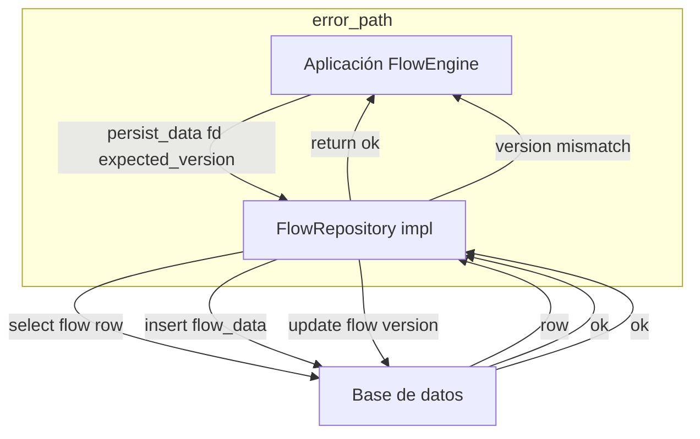
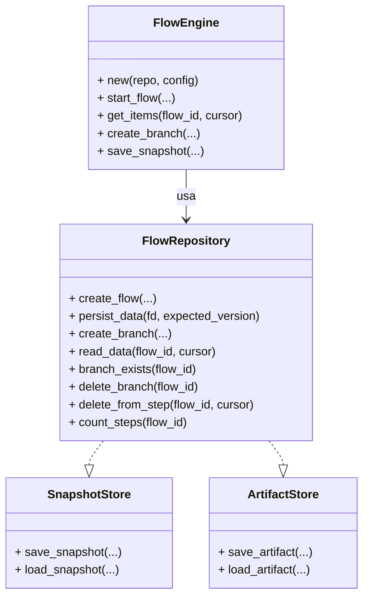
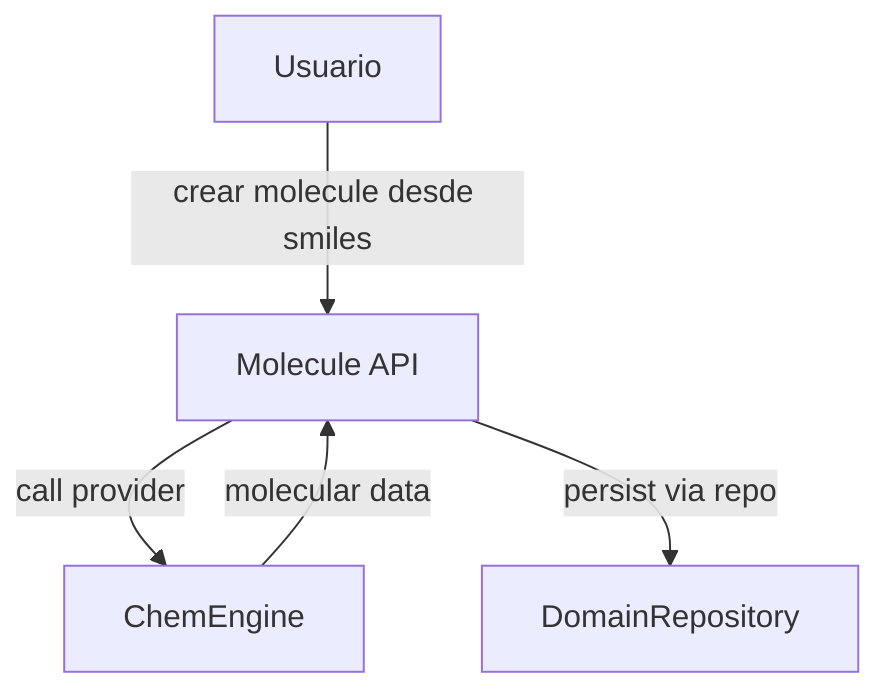
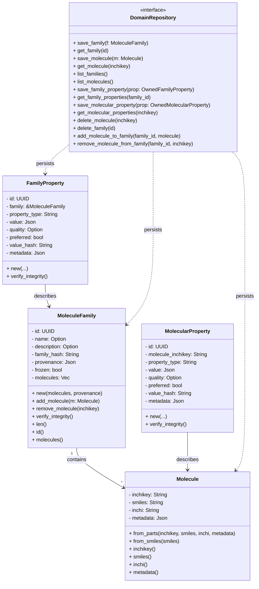
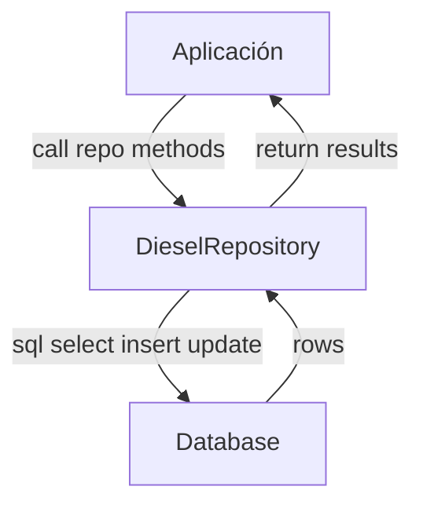
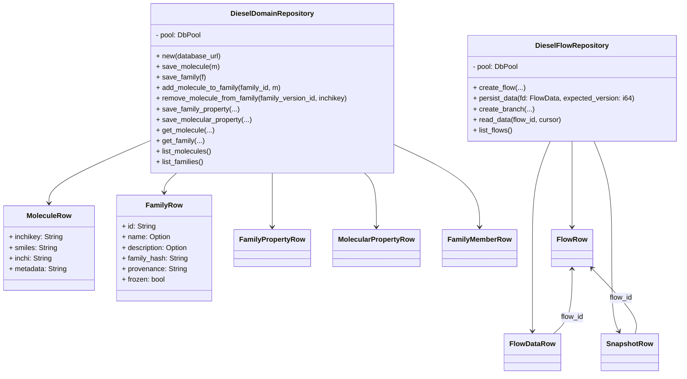
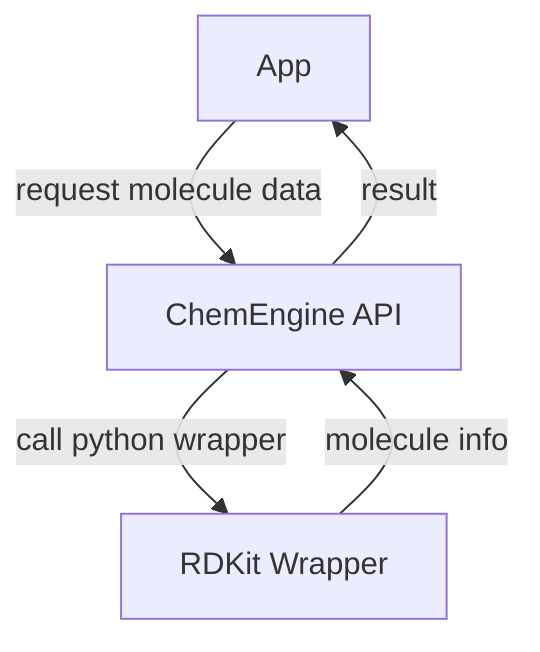
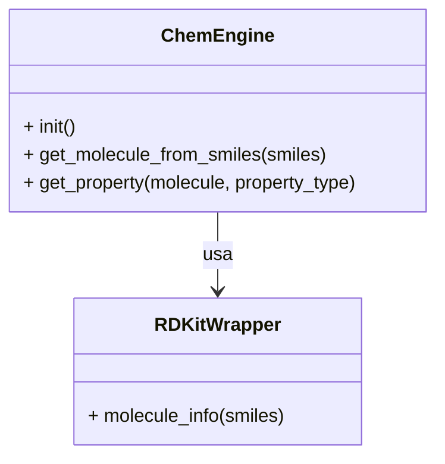

# flow-chem — Workspace README
## Índice
1. [Descripción general](#descripción-general)
2. [Levantamiento y desarrollo](#levantamiento-y-desarrollo)
3. [Estructura del workspace](#estructura-del-workspace)
4. [Arquitectura y ciclo de vida](#arquitectura-y-ciclo-de-vida)
5. [Crate `flow`](#crate-flow)
6. [Crate `chem-domain`](#crate-chem-domain)
7. [Crate `chem-persistence`](#crate-chem-persistence)
8. [Crate `chem-providers`](#crate-chem-providers)
9. [Repositorio en memoria y pruebas](#repositorio-en-memoria-y-pruebas)
10. [Ejemplos de uso](#ejemplos-de-uso)
11. [Cobertura y análisis estático](#cobertura-y-análisis-estático)
12. [Notas y buenas prácticas](#notas-y-buenas-prácticas)
---
## Descripción general
Este workspace implementa una plataforma modular para modelar, versionar y persistir flujos de trabajo y entidades químicas (moléculas, familias, propiedades) con integridad y trazabilidad. Incluye:
- **flow**: motor de flujos versionados y orquestación de datos.
- **chem-domain**: modelos inmutables y reglas del dominio químico.
- **chem-persistence**: persistencia Diesel (SQLite/Postgres) para flows y entidades químicas.
- **chem-providers**: integración con motores externos (ej. RDKit vía Python) para cálculo y parsing químico.
El diseño separa claramente dominio, persistencia y proveedores, permitiendo testeo, extensión y despliegue flexible.
---
## Levantamiento y desarrollo
### Requisitos previos
- Docker y docker-compose (recomendado para desarrollo y CI)
- Python 3.11+ y RDKit (si usas chem-providers localmente)
- Rust toolchain (nightly recomendado para cobertura)
### Levantar entorno de desarrollo
1. Clona el repositorio y copia `.env.example` a `.env` si existe (o define las variables requeridas):
   - `DATABASE_URL` (ejemplo: `file:memdb1?mode=memory&cache=shared` para SQLite, o URL de Postgres)
   - `PYO3_PYTHON` (opcional, ruta a Python con RDKit)
2. Levanta los servicios básicos (Postgres y contenedor de desarrollo):
   ```bash
   docker-compose up -d db app-dev
   ```
3. Espera a que la base de datos esté saludable. Puedes usar el script helper:
   ```bash
   ./scripts/run_tests_in_docker.sh
   ```
   Esto ejecuta los tests dentro del contenedor `app-dev` con todas las dependencias listas.
### Comandos útiles
- Ejecutar tests en local:
  ```bash
  cargo test --workspace
  ```
- Ejecutar tests en Docker:
  ```bash
  ./scripts/run_tests_in_docker.sh
  ```
- Generar cobertura:
  ```bash
  ./scripts/generate_coverage.sh
  ```
- Analizar con SonarQube:
  ```bash
  SONAR_TOKEN="<token>" ./scripts/run_sonar.sh --skip-build
  ```
### Variables de entorno principales
- `DATABASE_URL` o `CHEM_DB_URL`: cadena de conexión a la base de datos (SQLite o Postgres)
- `PYO3_PYTHON`: ruta a Python con RDKit (por defecto `/opt/conda/bin/python` en Docker)
### Estructura de Docker y compose
- `Dockerfile`: define etapas base (toolchain, dependencias) y builder (compilación). Incluye Python, RDKit, Rust y cargo-tarpaulin.
- `docker-compose.yml`: define servicios `db` (Postgres), `app` (runtime), `app-dev` (desarrollo, con cargo y bind-mount del workspace).
- Scripts en `scripts/` para cobertura, tests y análisis estático.
---
## Estructura del workspace
- `crates/flow/` - motor de flujos, traits y ejemplos.
- `crates/chem-domain/` - modelos e invariantes del dominio químico.
- `crates/chem-persistence/` - implementación Diesel de repositorios y migraciones.
- `crates/chem-providers/` - wrappers para RDKit y otras funcionalidades externas.
- `examples/` - ejemplos de uso que combinan los crates.
- `scripts/` - helpers para cobertura, tests y análisis estático.
---
## Arquitectura y ciclo de vida
El ciclo de vida típico es:
1. El usuario crea o importa una molécula/familia usando `chem-domain`.
2. Si se requiere, se calculan propiedades usando `chem-providers` (RDKit).
3. Se persisten entidades y flujos usando `chem-persistence` (SQLite/Postgres).
4. Los flujos de trabajo y sus pasos/versiones se gestionan con `flow`.
5. Para pruebas y desarrollo rápido, se usa el repositorio en memoria (`InMemoryFlowRepository`).
---
## Crate `flow`
Define los conceptos y traits para crear y versionar flujos de trabajo y sus datos. Proporciona interfaces para persistir pasos de un flujo, crear ramas y tomar snapshots.
### Diagrama de flujo (flow)

### Clases y traits (flow)

---
## Crate `chem-domain`
Modela las entidades químicas y las reglas de integridad. Es independiente de la capa de persistencia y depende opcionalmente de `chem-providers` para operaciones que requieren un motor químico.
### Diagrama de flujo (chem-domain)

### Clases y estructuras (chem-domain)

---
## Crate `chem-persistence`
Implementa `DomainRepository` y los traits de `flow` usando Diesel. Soporta SQLite para pruebas y Postgres como backend de producción (feature `pg`).
### Diagrama de flujo (chem-persistence)

### Clases y estructuras (chem-persistence)

**Notas importantes:**
- Usar `DATABASE_URL` o `CHEM_DB_URL` para configurar la conexión.
- Para desarrollo y tests locales se recomienda SQLite en memoria:
  ```bash
  export DATABASE_URL="file:memdb1?mode=memory&cache=shared"
  cd crates/chem-persistence
  cargo run --example persistence_simple_usage
  ```
---
## Crate `chem-providers`
Encapsula motores externos (como RDKit) y proporciona una API para crear moléculas desde SMILES, calcular propiedades y serializar resultados. En la implementación actual RDKit se expone vía un wrapper en Python y un binding ligero en Rust.
### Diagrama de flujo (chem-providers)

### Clases y estructuras (chem-providers)

---
## Repositorio en memoria y pruebas
El crate `flow` incluye una implementación en memoria (`InMemoryFlowRepository`) ideal para pruebas, demos y desarrollo rápido. Permite crear, versionar y manipular flujos sin requerir base de datos externa.
### Ejemplo de uso y pruebas (`crates/flow/tests/repo_inmemory.rs`)
El archivo `repo_inmemory.rs` contiene pruebas que validan el ciclo de vida de ramas, pasos y operaciones de borrado/prune en el repositorio en memoria:
- **delete_branch_removes_subtree**: Crea un flujo, añade pasos, crea una rama hija y verifica que al borrar la rama hija, el padre permanece y la hija desaparece.
- **delete_from_step_prunes_and_removes_subbranches**: Prunea un flujo desde un cursor, eliminando pasos y subramas a partir de ese punto.
- **count_steps_nonexistent_returns_minus_one**: Verifica que contar pasos en un flujo inexistente retorna -1.
- **child_preserves_steps_after_parent_deletion**: Crea un hijo desde un padre, borra el padre y verifica que el hijo y sus pasos/metadata se preservan.
**Fragmento de test relevante:**
```rust
let repo = InMemoryFlowRepository::new();
let parent = repo.create_flow(Some("parent".into()), Some("queued".into()), json!({})).unwrap();
// append steps, create branch, delete branch, assert existencia...
```
Esta implementación es útil para pruebas unitarias y para entender el ciclo de vida de los flujos sin depender de infraestructura externa.
---
## Ejemplos de uso
### Guardar y obtener una molécula (ejemplo mínimo)
```rust
use chem_domain::Molecule;
use chem_persistence::new_domain_from_env;
fn main() -> Result<(), Box<dyn std::error::Error>> {
    // Inicializa repo desde CHEM_DB_URL o DATABASE_URL
    let repo = new_domain_from_env()?;
    // Construir molécula desde SMILES (usa provider si está disponible)
    let m = Molecule::from_smiles("CCO")?;
    // Guardar y recuperar
    let key = repo.save_molecule(m.clone())?;
    let found = repo.get_molecule(&m.inchikey())?;
    println!("Guardada y recuperada: {:?}", found);
    Ok(())
}
```
### Obtener información de una molécula vía RDKit
```rust
use chem_domain::Molecule;
let m = Molecule::from_smiles("CCO")?; // internamente usa ChemEngine si está disponible
println!("InChIKey: {}", m.inchikey());
```
### Crear y versionar un flujo (flow)
```rust
use flow::stubs::InMemoryFlowRepository;
use flow::engine::FlowEngineConfig;
use flow::FlowEngine;
use serde_json::json;
use std::sync::Arc;
fn main() {
    let repo = Arc::new(InMemoryFlowRepository::new());
    let engine = FlowEngine::new(repo.clone(), FlowEngineConfig {});
    let flow_id = engine.start_flow(Some("example".into()), Some("queued".into()), json!({})).unwrap();
    println!("created flow {}", flow_id);
    // Añadir pasos, crear ramas, etc.
}
```
---
## Cobertura y análisis estático
- Generar cobertura (LCOV, Cobertura XML, Sonar):
  ```bash
  ./scripts/generate_coverage.sh
  ```
- Analizar con SonarQube (requiere token):
  ```bash
  SONAR_TOKEN="<token>" ./scripts/run_sonar.sh --skip-build
  ```
- Los artefactos de cobertura se generan en `coverage/` (lcov.info, cobertura.xml, sonar-generic-coverage.xml).
---
## Notas y buenas prácticas
- Usa SQLite en memoria para desarrollo rápido y tests (`file:memdb1?mode=memory&cache=shared`).
- Para producción, configura Postgres y la variable `DATABASE_URL`.
- Los scripts en `scripts/` automatizan cobertura, tests y análisis estático.
- Los diagramas Mermaid pueden exportarse a SVG/PNG si tu visor no los soporta.
- Abre issues para inconsistencias entre schema Diesel y migraciones.
- El ciclo de vida recomendado: desarrolla en `app-dev`, ejecuta tests y cobertura en Docker, y usa Sonar para análisis estático.
---
## Funcionamiento general y flujo de uso
### ¿Cómo funciona el sistema?
El sistema está diseñado para modelar, versionar y persistir entidades químicas y flujos de trabajo de manera trazable y reproducible. El ciclo de vida típico es:
1. **Definición de entidades químicas**: Se crean moléculas y familias usando `chem-domain`, que valida y asegura la integridad de los datos.
2. **Cálculo de propiedades**: Si se requiere, se calculan propiedades moleculares/familiares usando `chem-providers` (RDKit vía Python).
3. **Persistencia**: Las entidades y flujos se almacenan usando `chem-persistence` (SQLite para desarrollo/tests, Postgres para producción).
4. **Orquestación de flujos**: Se crean y versionan flujos de trabajo con `flow`, permitiendo ramificación, snapshots y seguimiento de pasos.
5. **Pruebas y desarrollo rápido**: Se puede usar el repositorio en memoria para tests y prototipos.
### ¿Cómo se usa en la práctica?
#### 1. Levantar el entorno (desarrollo o demo)
- **Con Docker (recomendado):**
    ```bash
    docker-compose up -d db app-dev
    # Ejecutar tests y ejemplos dentro del contenedor
    ./scripts/run_tests_in_docker.sh
    ```
- **Local (avanzado):**
  - Instala Rust, Python 3.11+, RDKit y dependencias Diesel.
  - Configura `DATABASE_URL` (ejemplo: SQLite en memoria para pruebas).
  - Ejecuta:
    ```bash
    cargo test --workspace
    cargo run --example example-domain
    ```

#### 2. Guardar y consultar una molécula
```rust
use chem_domain::Molecule;
use chem_persistence::new_domain_from_env;
fn main() -> Result<(), Box<dyn std::error::Error>> {
    let repo = new_domain_from_env()?;
    let m = Molecule::from_smiles("CCO")?;
    repo.save_molecule(m.clone())?;
    let found = repo.get_molecule(&m.inchikey())?;
    println!("Guardada y recuperada: {:?}", found);
    Ok(())
}
```
#### 3. Crear y versionar un flujo de trabajo
```rust
use flow::stubs::InMemoryFlowRepository;
use flow::engine::FlowEngineConfig;
use flow::FlowEngine;
use serde_json::json;
use std::sync::Arc;
fn main() {
    let repo = Arc::new(InMemoryFlowRepository::new());
    let engine = FlowEngine::new(repo.clone(), FlowEngineConfig {});
    let flow_id = engine.start_flow(Some("example".into()), Some("queued".into()), json!({})).unwrap();
    println!("created flow {}", flow_id);
}
```
#### 4. Consultar propiedades químicas vía RDKit
```rust
use chem_domain::Molecule;
let m = Molecule::from_smiles("CCO")?;
println!("InChIKey: {}", m.inchikey());
```
#### 5. Ejecutar cobertura y análisis estático
- Cobertura:
    ```bash
    ./scripts/generate_coverage.sh
    # Resultados en coverage/
    ```
- SonarQube:
    ```bash
    SONAR_TOKEN="<token>" ./scripts/run_sonar.sh --skip-build
    ```

### Notas de arquitectura y despliegue
- **Persistencia**: Puedes cambiar entre SQLite y Postgres cambiando la variable `DATABASE_URL`.
- **Extensibilidad**: Puedes agregar nuevos proveedores químicos implementando el trait correspondiente en `chem-providers`.
- **Pruebas**: Usa el repositorio en memoria para tests rápidos y sin dependencias externas.
- **Despliegue**: El contenedor `app` está listo para producción, solo requiere la variable de entorno de base de datos y, si se usa RDKit, acceso a Python.
---
## Estructura de carpetas del proyecto
```text
flow-chem/
├── Cargo.toml
├── Cargo.lock
├── Dockerfile
├── docker-compose.yml
├── docker-compose.coverage.yml
├── entrypoint.sh
├── README.md
├── README_COVERAGE.md
├── rust-toolchain
├── sonar-project.properties
├── todo.md
├── coverage/
│   ├── cobertura.xml
│   ├── lcov.info
│   └── sonar-generic-coverage.xml
├── crates/
│   ├── chem-domain/
│   │   ├── Cargo.toml
│   │   ├── README.md
│   │   └── src/
│   │       ├── domain_repository.rs
│   │       ├── domain_stubs.rs
│   │       ├── errors.rs
│   │       ├── family_property.rs
│   │       ├── lib.rs
│   │       ├── molecular_property.rs
│   │       ├── molecule_family.rs
│   │       └── molecule.rs
│   ├── chem-persistence/
│   │   ├── Cargo.toml
│   │   ├── README.md
│   │   ├── examples/
│   │   │   └── persistence_simple_usage.rs
│   │   ├── migrations/
│   │   │   ├── 00000000000001_create_schema/
│   │   │   └── 00000000000002_create_chem_tables/
│   │   ├── src/
│   │   │   ├── domain_persistence.rs
│   │   │   ├── flow_persistence.rs
│   │   │   ├── lib.rs
│   │   │   └── schema.rs
│   │   └── tests/
│   │       ├── domain_persistence.rs
│   │       └── integration_tests.rs
│   ├── chem-providers/
│   │   ├── Cargo.toml
│   │   ├── README.md
│   │   ├── requirements.txt
│   │   ├── python/
│   │   │   └── rdkit_wrapper.py
│   │   └── src/
│   │       ├── core.rs
│   │       └── lib.rs
│   └── flow/
│       ├── Cargo.toml
│       ├── README.md
│       ├── examples/
│       │   └── flow_simple_usage.rs
│       ├── src/
│       │   ├── domain.rs
│       │   ├── engine.rs
│       │   ├── errors.rs
│       │   ├── lib.rs
│       │   ├── repository.rs
│       │   └── stubs.rs
│       └── tests/
│           ├── full_system.rs
│           ├── repo_inmemory.rs
│           └── stubs_and_engine.rs
├── examples/
│   ├── example-domain.rs
│   └── example-main.rs
├── scanner/
│   └── sonar-scanner-4.8.0.2856-linux/
│       ├── bin/
│       ├── conf/
│       ├── jre.disabled.1758157536/
│       └── lib/
├── scripts/
│   ├── generate_coverage.sh
│   ├── run_sonar.sh
│   └── run_tests_in_docker.sh
├── src/
│   └── main.rs
└── target/
    ├── ...
    └── tarpaulin/
        └── chemflow-rust-coverage.json
```
