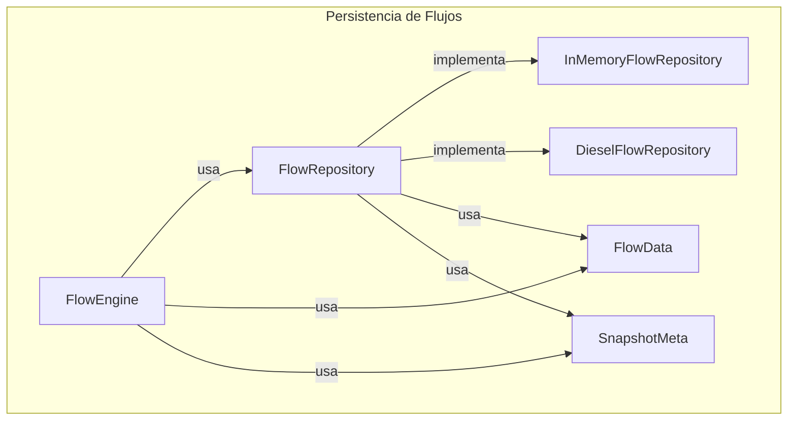
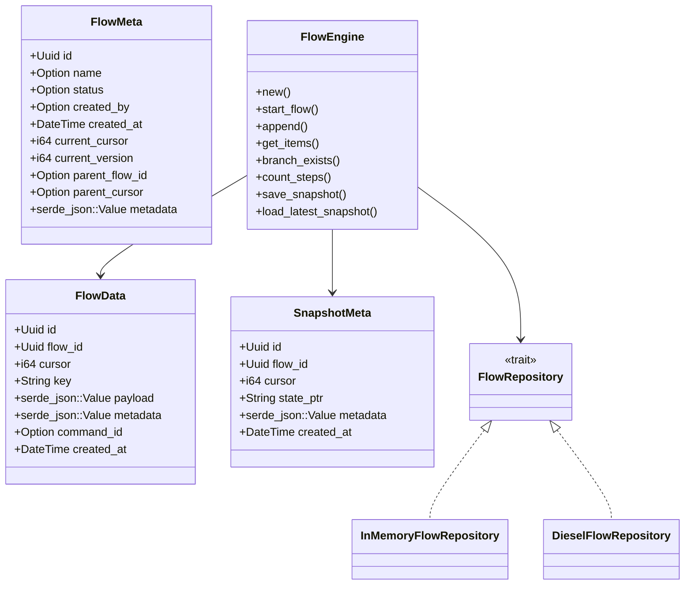
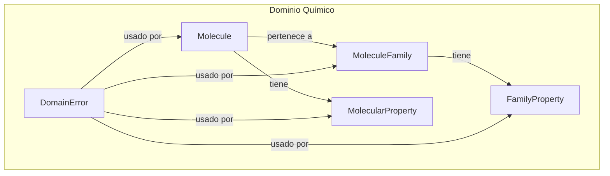
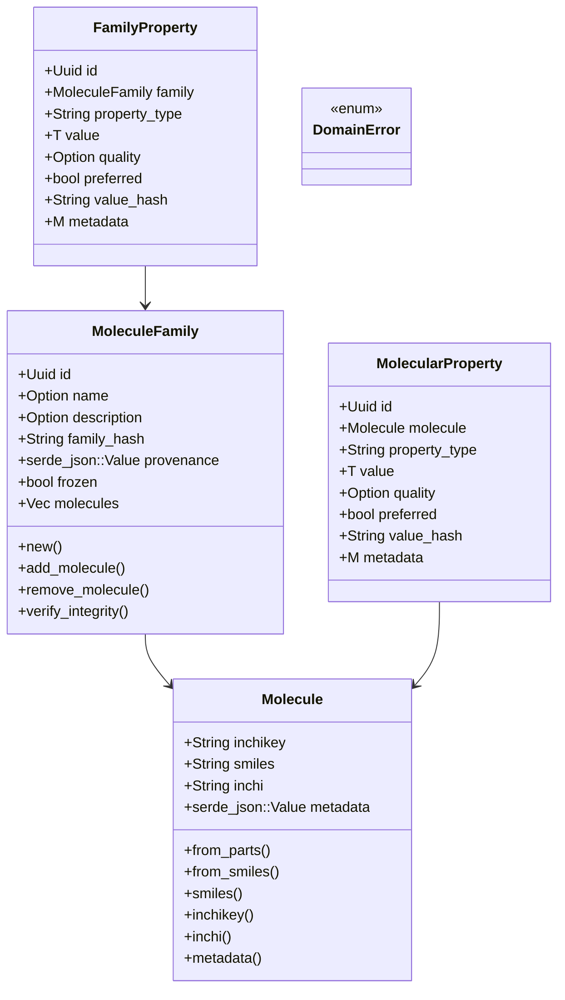
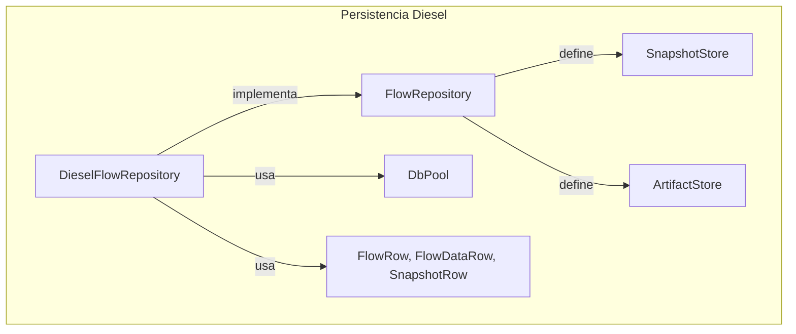
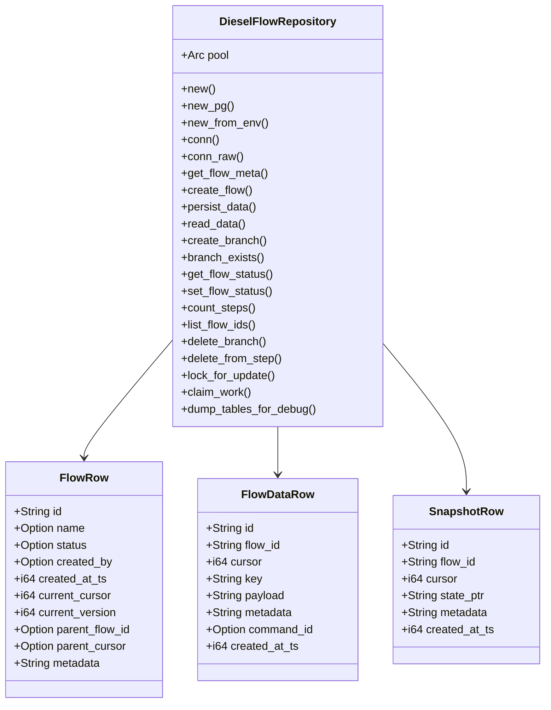
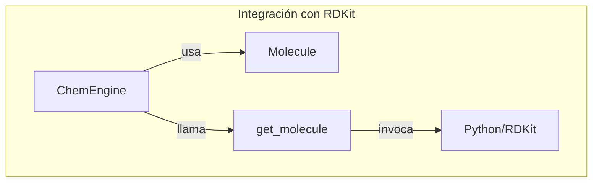
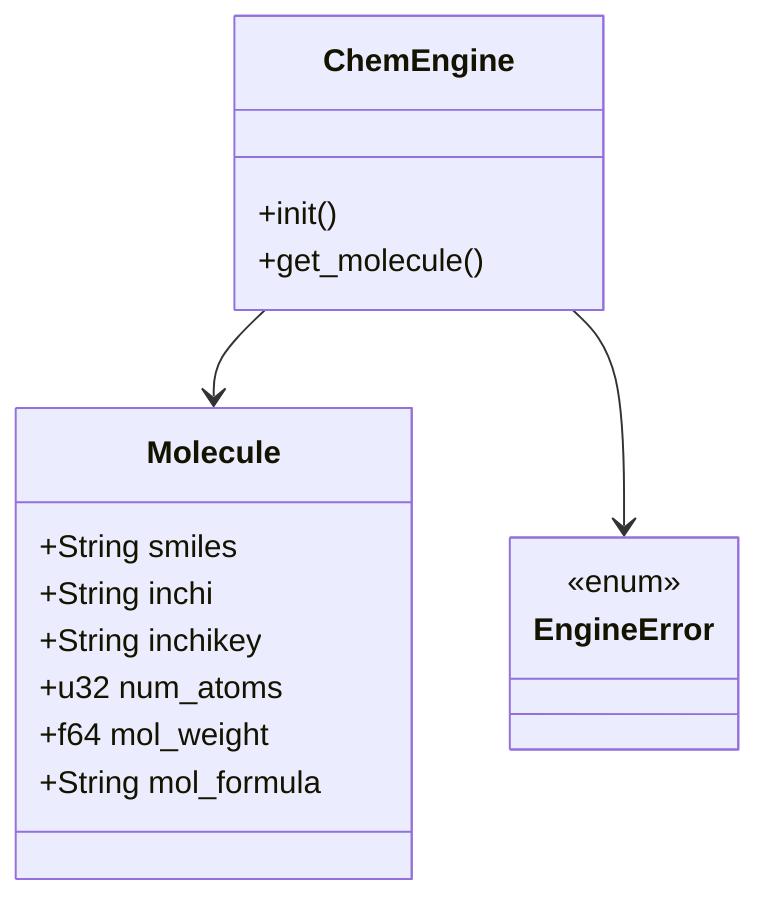

# Flow-Chem — descripción del workspace (en español)

Este repositorio contiene una pequeña plataforma de demostración para
persistencia de flujos basada en registros (`FlowData`) y ejemplos de
implementaciones (in-memory y Diesel). Está pensado como proyecto de
referencia, pruebas y ejemplos educativos.

Estructura principal

- `crates/flow`: definiciones de dominio (`FlowData`, `FlowMeta`), el trait
  `FlowRepository`, implementación en memoria (`InMemoryFlowRepository`) y
  `FlowEngine` con helpers para crear flujos, ramas y gestionar snapshots.

- `crates/chem-persistence`: implementación basada en Diesel (SQLite/Postgres)
  del trait `FlowRepository`.

- `crates/chem-domain`: tipos del dominio químico (moléculas, propiedades).

- `src/main.rs`: binario principal (`main-core`).

- `examples/`: ejemplos ejecutables (por ejemplo `example-main`).

Cómo ejecutar

- Ejecutar el binario principal (por defecto):

```bash
cargo run --bin main-core
```

- Ejecutar el ejemplo CLI movido a `examples/`:

```bash
cargo run --example example-main
```

- Ejecutar ejemplos del crate `flow`:

```bash
cd crates/flow
cargo run --example flow_simple_usage
```

Notas sobre configuración

- Muchas operaciones dependen de `DATABASE_URL` cuando se usa
  `chem-persistence` (Postgres o SQLite). Para desarrollo puedes usar
  SQLite en memoria: `file:memdb_...` o exportar una URL a Postgres.
- Revisa el archivo `.env.example` en la raíz para variables recomendadas.

Documentación y comentarios

- Los crates incluyen comentarios y documentación en español en archivos
  clave (`crates/flow/src/lib.rs`, `crates/flow/src/repository.rs`, etc.).
  Si deseas generar documentación con `cargo doc`, ejecuta:

```bash
cargo doc --workspace --no-deps --open
```

Contribuir

- Para añadir ejemplos o mejorar la persistencia, crea ramas y abre pull
  requests con pruebas que validen el comportamiento (especialmente
  operaciones de branching y borrado).

información de flujos y ramas
# Documentación completa del proyecto Flow-Chem

Este documento describe la arquitectura, las clases principales y el funcionamiento de todos los crates del proyecto `flow-chem`. Incluye diagramas de flujo de alto nivel para cada crate y detalla las estructuras, traits y funciones públicas implementadas.

---

## Índice

1. [Descripción general](#descripción-general)
2. [Estructura del workspace](#estructura-del-workspace)
3. [Crate `flow`](#crate-flow)
   - [Diagrama de flujo](#diagrama-de-flujo-flow)
   - [Clases y traits](#clases-y-traits-flow)
4. [Crate `chem-domain`](#crate-chem-domain)
   - [Diagrama de flujo](#diagrama-de-flujo-chem-domain)
   - [Clases y estructuras](#clases-y-estructuras-chem-domain)
5. [Crate `chem-persistence`](#crate-chem-persistence)
   - [Diagrama de flujo](#diagrama-de-flujo-chem-persistence)
   - [Clases y estructuras](#clases-y-estructuras-chem-persistence)
6. [Crate `chem-providers`](#crate-chem-providers)
   - [Diagrama de flujo](#diagrama-de-flujo-chem-providers)
   - [Clases y estructuras](#clases-y-estructuras-chem-providers)
7. [Ejemplos de uso](#ejemplos-de-uso)

---

## Descripción general

`flow-chem` es una plataforma modular para la persistencia y manipulación de flujos de datos y entidades químicas. Está compuesta por cuatro crates principales:

- `flow`: motor de persistencia basada en eventos y utilidades para flujos.
- `chem-domain`: tipos y errores del dominio químico (moléculas, familias, propiedades).
- `chem-persistence`: backend de persistencia usando Diesel (SQLite/Postgres).
- `chem-providers`: integración con motores químicos externos (RDKit vía Python).

## Estructura del workspace

```
flow-chem/
├── crates/
│   ├── flow/
│   ├── chem-domain/
│   ├── chem-persistence/
│   └── chem-providers/
├── examples/
├── scripts/
├── src/
└── ...
```

---

## Crate `flow`

### Diagrama de flujo (alto nivel)



### Clases y traits principales

- **Diagrama de clases:**



- **FlowData**: Evento persistente de un flujo. Campos: `id`, `flow_id`, `cursor`, `key`, `payload`, `metadata`, `command_id`, `created_at`.
- **FlowMeta**: Metadatos ligeros de un flujo (`id`, `name`, `status`, ...).
- **SnapshotMeta**: Metadatos de snapshot (`id`, `flow_id`, `cursor`, ...).
- **PersistResult**: Resultado de persistencia (`Ok { new_version }`, `Conflict`).
- **FlowRepository (trait)**: Contrato de persistencia de flujos. Métodos: `get_flow_meta`, `create_flow`, `persist_data`, `read_data`, `create_branch`, `branch_exists`, `get_flow_status`, `set_flow_status`, `count_steps`, `list_flow_ids`, `delete_branch`, `delete_from_step`, `lock_for_update`, `claim_work`, `dump_tables_for_debug`.
- **SnapshotStore (trait)**: Almacenamiento de snapshots.
- **ArtifactStore (trait)**: Almacenamiento de blobs/artifacts.
- **FlowEngine**: Motor de alto nivel para manipular flujos. Métodos: `new`, `start_flow`, `append`, `get_items`, `branch_exists`, `count_steps`, `save_snapshot`, `load_latest_snapshot`, etc.
- **InMemoryFlowRepository**: Implementación en memoria de `FlowRepository` (para pruebas).
- **GateService, InMemoryWorkerPool**: Utilidades para pruebas y control de gates.

---

## Crate `chem-domain`

### Diagrama de flujo (alto nivel)



### Clases y estructuras principales

- **Diagrama de clases:**



- **Molecule**: Molécula química (`inchikey`, `smiles`, `inchi`, `metadata`). Métodos: `from_parts`, `from_smiles`, getters, validaciones.
- **MoleculeFamily**: Colección inmutable de moléculas. Campos: `id`, `name`, `description`, `family_hash`, `provenance`, `frozen`, `molecules`. Métodos: `new`, `add_molecule`, `remove_molecule`, `verify_integrity`, getters.
- **FamilyProperty**: Propiedad calculada para una familia molecular. Genérica en valor y metadatos. Campos: `id`, `family`, `property_type`, `value`, `quality`, `preferred`, `value_hash`, `metadata`.
- **MolecularProperty**: Propiedad molecular con metadatos y verificación de integridad. Genérica en valor y metadatos. Campos: `id`, `molecule`, `property_type`, `value`, `quality`, `preferred`, `value_hash`, `metadata`.
- **DomainError**: Enum de errores del dominio (`ValidationError`, `ExternalError`, `SerializationError`).

---

## Crate `chem-persistence`

### Diagrama de flujo (alto nivel)



### Clases y estructuras principales

- **Diagrama de clases:**



- **DieselFlowRepository**: Backend de persistencia usando Diesel. Campos: `pool` (pool de conexiones). Métodos: `new`, `new_pg`, `new_from_env`, `conn`, `conn_raw`, y todos los del trait `FlowRepository`.
- **FlowRow, FlowDataRow, SnapshotRow**: Estructuras internas para mapear filas de la base de datos.
- **DbPool**: Pool de conexiones (Postgres o SQLite).

---

## Crate `chem-providers`

### Diagrama de flujo (alto nivel)



### Clases y estructuras principales

- **Diagrama de clases:**



- **ChemEngine**: Motor químico que inicializa y expone acceso a RDKit vía Python. Métodos: `init`, `get_molecule`.
- **Molecule**: Estructura deserializada desde Python/RDKit (`smiles`, `inchi`, `inchikey`, `num_atoms`, `mol_weight`, `mol_formula`).
- **EngineError**: Enum de errores de integración (`Init`, `GetMolecule`).

---

## Ejemplos de uso

### Crear y manipular un flujo en memoria

```rust
use flow::stubs::InMemoryFlowRepository;
use flow::engine::FlowEngineConfig;
use std::sync::Arc;
let repo = Arc::new(InMemoryFlowRepository::new());
let engine = flow::FlowEngine::new(repo, FlowEngineConfig {});
let flow_id = engine.start_flow(Some("demo".into()), Some("queued".into()), serde_json::json!({})).unwrap();
```

### Crear una molécula y una familia

```rust
use chem_domain::{Molecule, MoleculeFamily};
let mol = Molecule::from_smiles("CCO").unwrap();
let family = MoleculeFamily::new(vec![mol], serde_json::json!({"source": "test"})).unwrap();
```

### Usar el backend Diesel para persistencia

```rust
use chem_persistence::DieselFlowRepository;
let repo = DieselFlowRepository::new("file:memdb1?mode=memory&cache=shared");
```

### Obtener información de una molécula vía RDKit

```rust
use chem_providers::ChemEngine;
let engine = ChemEngine::init().unwrap();
let mol = engine.get_molecule("CCO").unwrap();
```

---

## Notas finales

- Todos los crates están completamente documentados en español.
- Los diagramas de flujo muestran la interacción de las clases y traits principales.
- Para más detalles, consulta los archivos fuente y los ejemplos incluidos en el repositorio.
