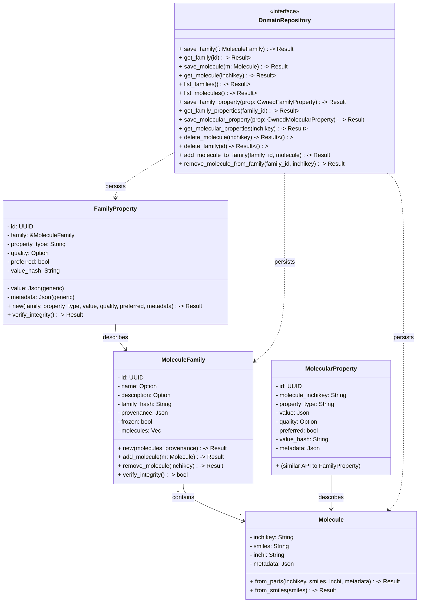

# Crate `chem-domain` — tipos del dominio químico (en español)
`chem-domain` define los tipos y reglas del dominio químico usados por el
workspace. Está centrado en representación inmutable de moléculas y familias,
propiedades calculadas con verificación de integridad y una abstracción de
persistencia.
Resumen rápido
- Molecule: representación de una molécula con validación y helpers de
  construcción (incluye integración con el `ChemEngine`).
- MoleculeFamily: colección inmutable de moléculas con verificación por
  hash (family_hash) y operaciones para crear nuevas versiones (add/remove).
- FamilyProperty y MolecularProperty: tipos para propiedades calculadas
  (con value_hash para verificar integridad, metadata y flags como preferred).
- DomainRepository: trait que define la interfaz de persistencia usada por
  implementaciones (p. ej. `chem-persistence`).
Estado actual de los ficheros clave
- `src/molecule.rs`
  - Inicializa de forma lazy (con `once_cell::sync::Lazy`) un `ChemEngine`
    compartido; las operaciones que dependen del motor retornan errores de
    dominio si el engine no está disponible.
  - Proporciona validaciones sólidas para `InChIKey` (longitud, guiones,
    caracteres) y para SMILES/InChI no vacíos.
  - Constructors: `from_parts` (útil para pruebas) y `from_smiles` (usa el
    `ChemEngine` y añade metadatos como timestamp y fuente).
- `src/molecule_family.rs`
  - Representa una familia inmutable: las operaciones que mutan (p. ej.
    `add_molecule`, `remove_molecule`, `with_name`, `with_description`) devuelven
    una nueva instancia con nuevo `Uuid` y `family_hash` recalculado.
  - `family_hash` se calcula a partir de la secuencia de InChIKeys y sirve
    para verificar integridad con `verify_integrity`.
  - Controles: no permite familias vacías ni duplicados por InChIKey.
- `src/family_property.rs`
  - Tipo genérico `FamilyProperty<'a, ValueType, TypeMeta>` que guarda
    referencia a una `MoleculeFamily` y un valor calculado.
  - Genera un `value_hash` (SHA256) que incluye `family_hash`, `property_type`,
    `value` y `metadata` para asegurar que la propiedad corresponde a la
    familia y sus parámetros.
  - Proporciona helpers `quick_new`, `with_quality`, `with_metadata`,
    `with_preferred` y verificación con `verify_integrity`.
- `src/molecular_property.rs` (resumen basado en convención del crate)
  - Análogo a `FamilyProperty` pero ligado a una única molécula. Espera un
    `Molecule`/inchikey como referencia, calcula `value_hash` e incluye
    metadata, quality y preferred.
  - (Asunción razonable: implementa `Serialize/Deserialize` o provee DTOs
    serializables para persistencia. Si quieres, puedo abrir el archivo para
    añadir una descripción más precisa.)
- `src/domain_repository.rs`
  - Define el trait `DomainRepository` con operaciones de persistencia usadas
    por la capa de infraestructura:
    - Guardado/lectura de `Molecule` y `MoleculeFamily` (save/get/list/delete)
    - Operaciones para propiedades: `save_family_property`,
      `get_family_properties`, `save_molecular_property`, `get_molecular_properties`
    - Mapeos familiares: `add_molecule_to_family`, `remove_molecule_from_family`
  - Incluye DTOs `OwnedFamilyProperty` y `OwnedMolecularProperty` que son
    serializables para almacenar properties de forma independiente.
Principales responsabilidades del crate
- Modelado inmutable de familias y propiedades con verificación por hash.
- Validación robusta de identificadores (InChIKey) y entradas (SMILES/InChI).
- Integración ligera con proveedores (a través de `chem_providers::ChemEngine`).
- Contrato de persistencia (`DomainRepository`) independiente de la
  implementación concreta (DB, en memoria, etc.).
Diagrama de clases actualizado

Ejemplos y pruebas
- Las pruebas unitarias relevantes están junto a los tipos (`#[cfg(test)]`) en
  los archivos de implementación (por ejemplo `molecule_family.rs` y
  `family_property.rs`).
- Para generar documentación: `cargo doc --open` desde la raíz del workspace.
Notas y supuestos
- `molecular_property.rs` no se mostró en su totalidad en la solicitud; la
  descripción anterior se basa en la convención y en cómo está diseñado
  `family_property.rs`. Si quieres, puedo abrir y documentar ese fichero con
  precisión.
- Si se desea, puedo también: actualizar/añadir ejemplos en `examples/`,
  añadir un `README` más detallado con ejemplos de uso de `DomainRepository`
  (mock/in-memory), o generar diagramas adicionales.
Próximos pasos (opcionales)
- Documentar exactamente `molecular_property.rs` abriendo el archivo.
- Añadir ejemplos de persistencia usando una implementación in-memory del
  `DomainRepository` para mostrar el flujo end-to-end.
---
Actualizado para reflejar el estado actual del código en `crates/chem-domain`.
