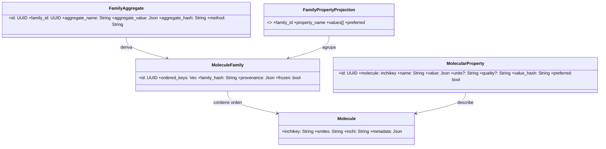

# Crate `chem-domain` — tipos del dominio químico (en español)

El crate `chem-domain` contiene las definiciones de tipos y errores usados
en la parte de dominio química del proyecto. Proporciona estructuras
reutilizables para moléculas, familias de moléculas y propiedades.

Contenido principal

- `Molecule`: estructura que representa una molécula con SMILES, InChIKey
  y metadatos.
- `MoleculeFamily`: colección inmutable de moléculas con hash de integridad.
- `FamilyProperty` y `MolecularProperty`: tipos para propiedades calculadas
  con verificación y metadatos.
- `DomainError`: enum de errores del dominio.

Uso y ejemplos

Este crate está pensado para ser usado por otros crates del workspace. Un
ejemplo de uso básico:

```rust
use chem_domain::Molecule;

let m = Molecule::from_parts("INCHIKEY", "CCO", "InChI=1S/CH4O...", serde_json::json!({}));
```

Documentación y pruebas

- La documentación en el código está escrita en español y se puede generar
  con `cargo doc --open` desde la raíz del workspace.
- Las pruebas unitarias del crate se encuentran en `crates/chem-domain/src/*`.

Buenas prácticas

- Mantener las funciones públicas documentadas con comentarios en español
  para facilitar su uso por desarrolladores hispanohablantes.
- Añadir ejemplos y tests al ampliar tipos o introducir operaciones costosas
  (p. ej. cálculo de propiedades).
### 3.1 Class Diagram (Dominio Puro)



