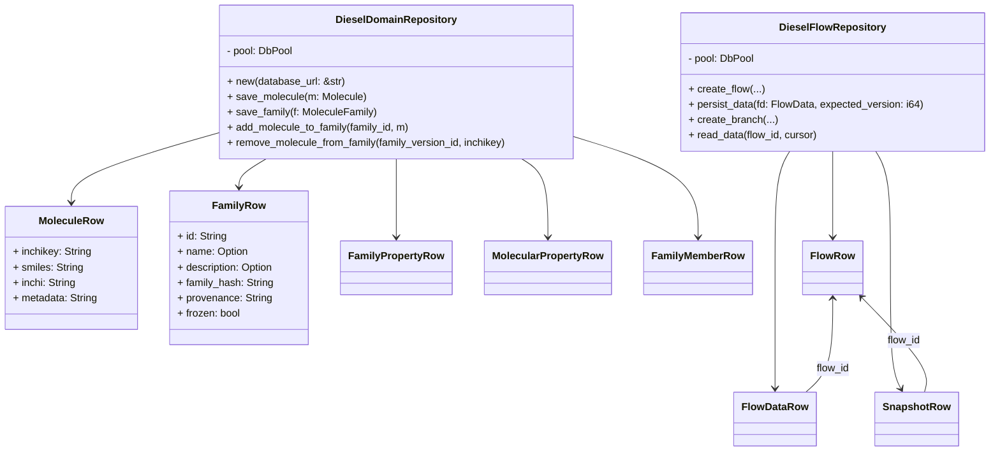
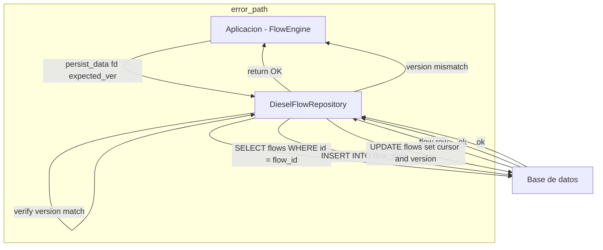

# Crate `chem-persistence` — implementación Diesel de persistencia

Este crate provee una implementación basada en Diesel (SQLite para tests
y opcionalmente Postgres con la feature `pg`) de los contracts de persistencia
usados en el workspace: las abstracciones de `flow` (FlowRepository /
SnapshotStore / ArtifactStore) y el trait de dominio `DomainRepository`
definido en `crates/chem-domain`.

Resumen rápido

- Implementaciones Diesel para persistir flujos (`flows`, `flow_data`,
  `snapshots`) y objetos químicos (`molecules`, `families`, `family_properties`,
  `molecular_properties`, `family_members`).
- Soporte para SQLite (tests / uso local) y Postgres (feature `pg`).
- Helpers de inicialización desde variables de entorno: `new_from_env`,
  `new_domain_repo_from_env` y `new_sqlite_for_test` (tests).
- Ejemplos y tests que muestran el ciclo de vida: creación de flows,
  branching, persistencia de datos y gestión de familias y propiedades.

Archivos principales

- `src/lib.rs` — reexporta los repositorios y expone el módulo `schema`.
- `src/schema.rs` — definición Diesel de las tablas usadas por la
  persistencia de flows y entidades químicas.
- `src/flow_persistence.rs` — implementación de `DieselFlowRepository`
  (implementa `FlowRepository`, `SnapshotStore`, `ArtifactStore`).
- `src/domain_persistence.rs` — implementación de `DieselDomainRepository`
  que implementa `DomainRepository` del crate `chem-domain`.
- `migrations/` — migraciones Diesel utilizadas para crear las tablas
  necesarias (`00000000000001_create_schema`, `00000000000002_create_chem_tables`).
- `examples/persistence_simple_usage.rs` — ejemplo que muestra uso básico
  de la persistencia (crear flows, ramas, persistir pasos, dump tables).
- `tests/` — pruebas de integración y unitarias que ejercitan la lógica
  de persistencia para flows y dominio químico (`domain_persistence.rs`,
  `integration_tests.rs`).

Contratos y puntos de extensión

- El crate implementa los traits definidos en `flow` y `chem-domain`, por lo
  que puede usarse como backend de persistencia para las capas superiores
  del sistema. Cambiar entre SQLite y Postgres se controla por la feature
  `pg` y la variable de entorno `DATABASE_URL` / `CHEM_DB_URL`.

Cómo usar (rápido)

1. Para ejecutar el ejemplo localmente usando SQLite en memoria:

```bash
cd crates/chem-persistence
export DATABASE_URL="file:memdb1?mode=memory&cache=shared"
cargo run --example persistence_simple_usage
```

1. Para tests del dominio que usan SQLite (ya incluidos en `tests/`):

```bash
cd crates/chem-persistence
cargo test
```

1. Para usar Postgres (feature `pg`): establece `DATABASE_URL` con la URL
  de tu base de datos y compila con la feature `pg`.

Diagrama de clases

Representación de alto nivel de los tipos clave y su relación con Diesel
rows/repositories.



Diagrama de flujo — persistencia de un nuevo paso (alta nivel)

Este diagrama muestra el flujo cuando el motor de aplicación persiste un
nuevo `FlowData` usando `DieselFlowRepository::persist_data`.



Notas y buenas prácticas

- Para tests aislados se recomienda usar `DATABASE_URL` apuntando a
  `file:memdb_...` con `cache=shared` para evitar bloqueos entre hilos.
- Las migraciones incluidas deben ejecutarse antes de usar la base de datos
  real en Postgres; en el modo embebido (`embed_migrations!`) las migraciones
  se aplican automáticamente en `new_from_env`/`new`.
- El crate expone funciones helper `new_from_env` y `new_domain_repo_from_env`
  para facilitar la inicialización desde entornos distintos (CI, local,
  containers).

Contribuir

- Abrir issues para inconsistencias entre la schema Diesel y las migraciones.
- Añadir tests que reproduzcan fallos de concurrencia (persist_data) o
  casos límite en versionado/branching.

Licencia

Este repositorio hereda la licencia del workspace principal. Consulta el
`LICENSE` en la raíz del proyecto.

---
Generado a partir de los READMEs de los crates `chem-domain` y `flow` y
los archivos fuente en `src/` del presente crate.
