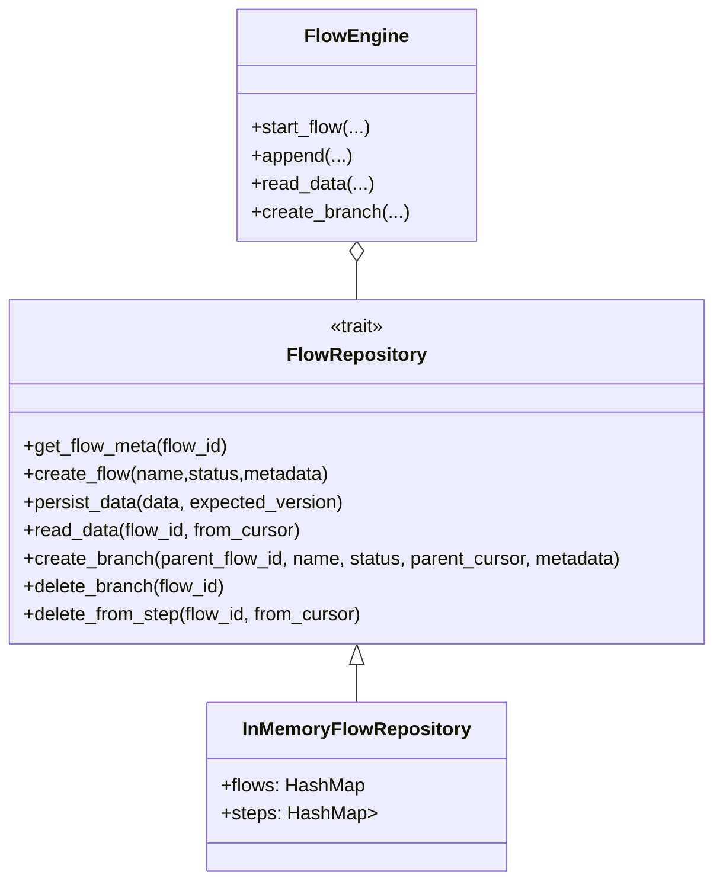
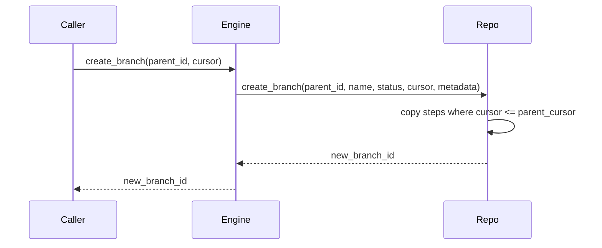
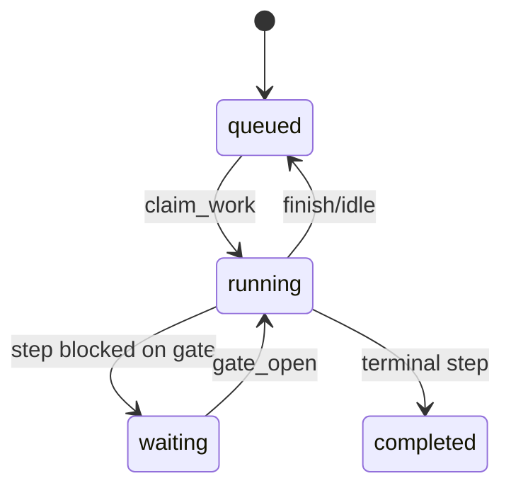

# Crate `flow` — documentación ampliada

Este crate proporciona una capa de persistencia orientada a eventos para
flujos de trabajo. Su responsabilidad principal es almacenar registros
autocontenidos (`FlowData`), gestionar snapshots y soportar la creación
de ramas (branches). La ejecución de la lógica de negocio de cada paso
queda fuera del crate: un worker o motor externo se rehidrata desde los
registros y aplica la lógica correspondiente.

Contenido principal

- `FlowRepository` — trait que define el contrato de persistencia (Postgres,
  in-memory, etc.).
- `InMemoryFlowRepository` — implementación en memoria para demos y pruebas.
- `FlowEngine` — helpers ergonómicos que usan el repositorio para facilitar
  operaciones comunes (append, read, snapshots, create_branch, etc.).
- `FlowData`, `FlowMeta`, `SnapshotMeta`, `PersistResult` — tipos de dominio.

Quick start

1. Desde la raíz del workspace:

```bash
cd crates/flow
cargo run --example simple_usage
```

2. El ejemplo `examples/simple_usage.rs` muestra un flujo completo:
   crear un flow, añadir pasos, crear ramas, crear subramas, eliminar
   ramas y eliminar desde un cursor (prune).

Principios de diseño

- Persistencia basada en registros (`FlowData`): cada registro es
  autocontenido y permite reconstruir el estado con snapshot + replay.
- Idempotencia: se soporta `command_id` para evitar duplicados.
- Locking optimista: operaciones de persistencia reciben `expected_version`
  para evitar races y retornan `Conflict` en caso de desajuste.
- Creación de ramas: el repositorio debe crear la rama de forma atómica
  (copiar pasos hasta el cursor dado y adicionar un `BranchCreated`).

Diagrama de clases (simplificado)



Diagrama de secuencia: crear rama desde cursor



Diagrama de estado simplificado de un `Flow`



Notas prácticas

- `InMemoryFlowRepository` es útil para pruebas rápidas y ejemplos, pero
  no sustituye una implementación transaccional en Postgres + object store
  para snapshots/artifacts.
- Para producción, implemente `FlowRepository` sobre Postgres y Object
  Storage (S3, MinIO). Asegúrate de que `create_branch`, `delete_branch`
  y `delete_from_step` se ejecuten dentro de transacciones donde sea
  necesario.

Tests y validación

- Encontrarás pruebas de integración en `crates/flow/tests/` que cubren
  el comportamiento del `InMemoryFlowRepository` (prune, delete branch,
  count_steps).

Contribuciones y siguientes pasos

- Añadir una implementación productiva `PostgresFlowRepository`.
- Mejorar el modelo de snapshots (copias copy-on-write para artifacts).
- Añadir más ejemplos y pruebas que simulen concurrencia.

