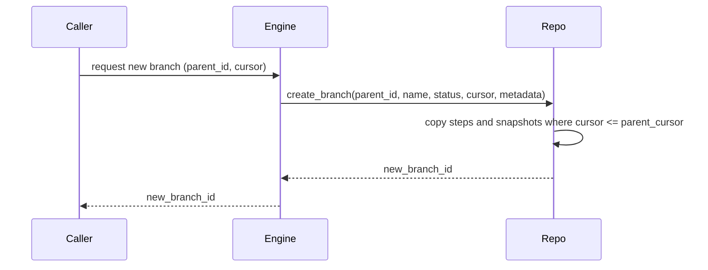
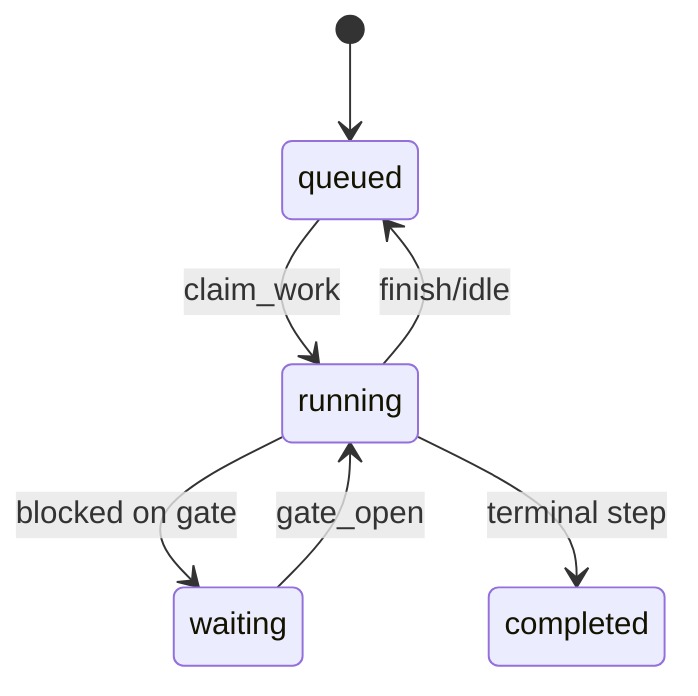

## Crate `flow` — documentación resumida en español

El crate `flow` define los tipos y traits que modelan la persistencia basada
en registros (`FlowData`) y provee implementaciones en memoria (stubs) y un
motor de ayuda (`FlowEngine`) para rehidratación y operaciones ergonomicas.

Contenido principal

- `FlowRepository` — trait que define el contrato de persistencia (Postgres,
  SQLite, in-memory, etc.).
- `InMemoryFlowRepository` — implementación en memoria para demos y pruebas.
- `FlowEngine` — helpers que usan el repositorio para operaciones comunes
  (crear flujo, añadir pasos, crear ramas, snapshots, etc.).
- Tipos de dominio: `FlowData`, `FlowMeta`, `SnapshotMeta`, `PersistResult`.


Inicio rápido

1. Desde la raíz del workspace, ejecutar el ejemplo de uso en memoria:

```bash
cd crates/flow
cargo run --example flow_simple_usage
```

2. El ejemplo muestra: crear un flujo, añadir pasos, crear ramas y subramas,
   añadir pasos en las ramas, y consultar/depurar el contenido.

Principios y comportamiento

- Persistencia por registros: cada `FlowData` es autocontenido y permite
  reconstruir el estado mediante snapshot + replay.
- Idempotencia: se admite `command_id` en `FlowData` para prevenir duplicados.
- Locking optimista: operaciones que modifican el flujo usan `expected_version`
  para detectar conflictos y devolver `PersistResult::Conflict` cuando aplica.
- Branching: `create_branch` debe ser atómico desde la perspectiva del
  repositorio (copiar pasos y snapshots hasta el cursor indicado).

Diagramas (resumen)

Diagrama de secuencia (crear rama desde engine -> repo):



Estado simplificado de un flow:



Notas prácticas y comportamiento importante

- `InMemoryFlowRepository` es una implementación apta para pruebas y ejemplos.
  No es transaccional ni durable; para producción se recomienda una
  implementación sobre Postgres + object store para snapshots y artifacts.
- `delete_branch` en las implementaciones actuales NO borra recursivamente
  ramas hijas; en su lugar las orfana (actualiza `parent_flow_id`/`parent_cursor`
  a NULL). Ajusta la implementación si necesitas borrado recursivo.

Tests y validación

- Tests unitarios y de integración para `InMemoryFlowRepository` se encuentran
  en `crates/flow/tests/`.
- Para ejecutar los tests del crate `flow`:

```bash
cargo test -p flow
```

Cómo ejecutar ejemplos y uso local

- Ejecutar el ejemplo de uso en memoria (desde el crate):

```bash
cd crates/flow
cargo run --example flow_simple_usage
```

- Ejecutar el ejemplo `flow_simple_usage` desde la raíz del workspace:

```bash
cargo run -p flow --example flow_simple_usage
```

- Notas de entorno: si algún ejemplo o test depende de `DATABASE_URL` u otras
  variables, define esas variables en el entorno o usa un `.env` en la raíz.

Contribuciones y siguientes pasos

- Implementar `PostgresFlowRepository` (transaccional) y un `SnapshotStore`
  que guarde estados en un object store.
- Añadir pruebas de concurrencia y validación de copia de snapshots al crear
  ramas.
