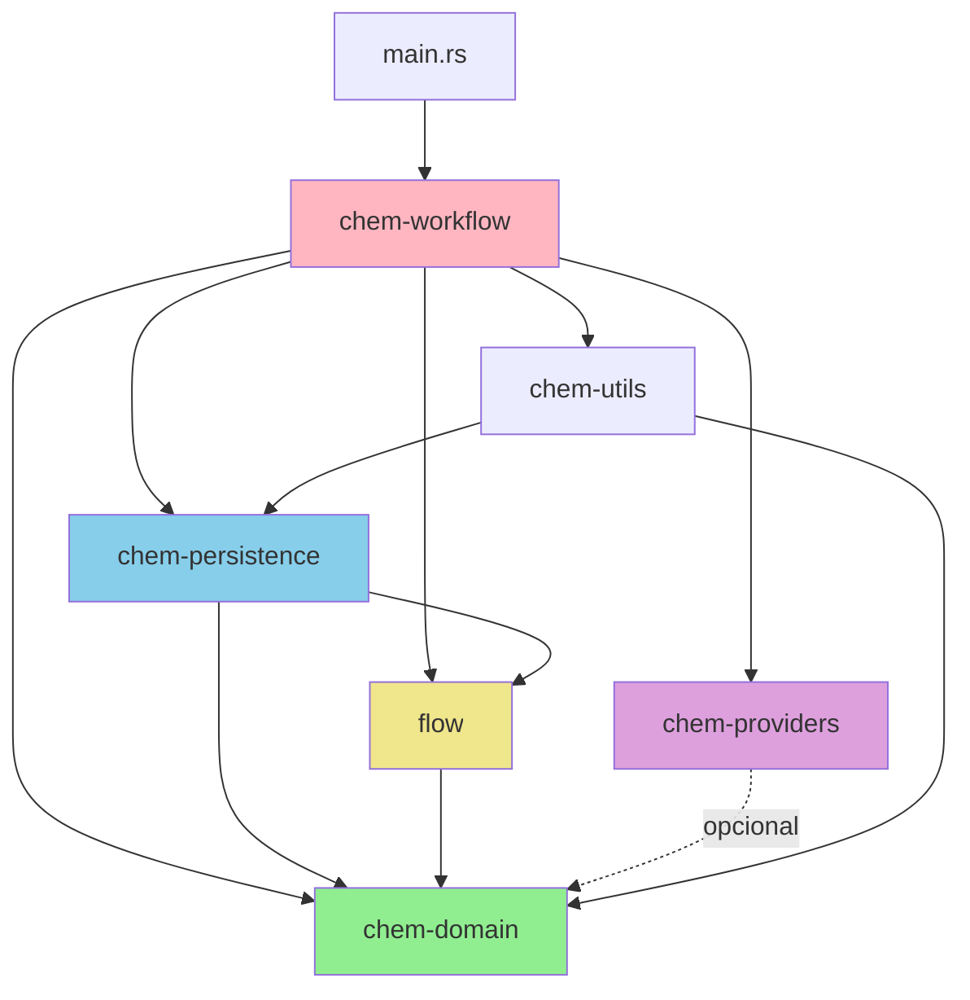

# Arquitectura Actual del Proyecto flow-chem

## Resumen Ejecutivo

**Estado**: Monolítico modularizado con acoplamiento medio-alto  
**Tests**: 42 tests pasando (100% success rate)  
**Cobertura estimada**: ~45-50% (sin métricas formales)  
**Problemas principales**: Dependencias circulares implícitas, violaciones SOLID, lógica dispersa

## Estructura de Crates

```
flow-chem/
├── crates/
│   ├── chem-domain/          # Dominio: 10 tests unitarios + 3 integración
│   │   ├── src/
│   │   │   ├── domain_repository.rs    # Trait con 10+ métodos (violación ISP)
│   │   │   ├── domain_stubs.rs         # Implementación in-memory
│   │   │   ├── errors.rs               # Enum de errores
│   │   │   ├── molecule.rs             # Entidad principal
│   │   │   ├── molecule_family.rs      # Agregado
│   │   │   ├── molecular_property.rs   # Value Object
│   │   │   └── family_property.rs      # Value Object
│   │   └── tests/
│   │       └── molecule_operations.rs  # Tests de integración
│   │
│   ├── chem-persistence/     # Persistencia: 3 tests integración + 1 dominio
│   │   ├── src/
│   │   │   ├── db.rs                   # Pool de conexiones
│   │   │   ├── domain_persistence.rs   # Adapter Diesel (dominio)
│   │   │   ├── flow_persistence.rs     # Adapter Diesel (flujos)
│   │   │   ├── migrations.rs           # Gestión de migraciones
│   │   │   └── schema.rs               # Schema Diesel
│   │   ├── migrations/                 # Migraciones SQL
│   │   └── tests/
│   │       ├── domain_persistence.rs   # Tests con DB real
│   │       ├── integration_tests.rs    # Tests de flows
│   │       └── structure_integration.rs
│   │
│   ├── chem-providers/       # Externos: 5 tests unitarios
│   │   ├── src/
│   │   │   ├── core.rs                 # Wrapper RDKit
│   │   │   └── test_utils.rs           # Mocks
│   │   ├── python/
│   │   │   └── rdkit_wrapper.py        # Bridge Python
│   │   └── requirements.txt
│   │
│   ├── chem-utils/           # Helpers: 0 tests (solo utilities)
│   │   └── src/
│   │       └── test_helpers/           # Helpers para otros crates
│   │           ├── mod.rs
│   │           ├── db_helpers.rs
│   │           └── mock_helpers.rs
│   │
│   ├── chem-workflow/        # Orquestación: 4 tests E2E
│   │   ├── src/
│   │   │   ├── errors.rs
│   │   │   ├── workflow_type.rs
│   │   │   ├── engine/                 # Engine genérico
│   │   │   ├── factory/                # Factory de workflows
│   │   │   ├── flows/                  # Implementaciones concretas
│   │   │   │   └── cadma_flow/
│   │   │   │       ├── mod.rs
│   │   │   │       ├── context.rs      # StepContext (violación SRP)
│   │   │   │       └── steps/          # 6 steps diferentes
│   │   │   └── step/                   # Abstracciones de pasos
│   │   │       ├── context.rs
│   │   │       ├── constants.rs
│   │   │       └── trait_step.rs
│   │   └── tests/
│   │       ├── cadma_flow_e2e.rs       # E2E con branching
│   │       ├── context_rehydration.rs  # Rehydration test
│   │       ├── full_flow_branching.rs  # Branching completo
│   │       ├── full_flow_e2e.rs        # E2E completo (RDKit)
│   │       └── step5_basic.rs          # Test unitario step
│   │
│   └── flow/                 # Engine base: 11 tests (3 branching + 8 behavior)
│       ├── src/
│       │   ├── domain.rs               # DTOs (FlowData, FlowMeta, etc.)
│       │   ├── engine.rs               # Engine genérico
│       │   ├── errors.rs               # Errores de flow
│       │   ├── repository.rs           # Trait FlowRepository
│       │   └── stubs.rs                # In-memory impl
│       └── tests/
│           ├── branching_tree.rs       # Branching + rehydration
│           ├── create_branch_from_middle_point.rs
│           ├── inmemory_behavior.rs    # Behavior tests
│           └── rehydrate_full_flow.rs
│
├── src/
│   └── main.rs               # Entrypoint (0 tests)
│
├── examples/                 # Ejemplos de uso
├── scripts/                  # Scripts de utilidad
└── docker-compose.yml        # Infraestructura
```

## Flujo de Dependencias Actual

### Grafo de Dependencias entre Crates



**Leyenda**:

- Verde (chem-domain): Núcleo de dominio
- Rosa (chem-workflow): Orquestación (alto acoplamiento)
- Azul (chem-persistence): Adapter de persistencia
- Morado (chem-providers): Adapter de externos
- Amarillo (flow): Engine genérico

### Problemas Identificados

1. **Dependencia circular implícita**:

   - `chem-workflow` → `chem-persistence` → `flow` → (indirecto) `chem-domain`
   - `chem-workflow` también depende de `chem-domain`
   - Solución: Hexagonal con ports en dominio

2. **Acoplamiento alto**:

   - `chem-workflow` conoce impls concretas de `DieselFlowRepository`
   - `StepContext` tiene 3 repos diferentes (violación SRP)
   - No hay inyección de dependencias formal

3. **Lógica dispersa**:
   - Engine logic en `chem-workflow/src/engine/` y `flow/src/engine.rs`
   - Factory pattern duplicado en ambos crates

## Análisis por Capa

### Capa de Dominio (`chem-domain`)

**Estado**: Relativamente limpio pero con violaciones menores

**Entidades**:

- `Molecule`: Inmutable, bien diseñada (✓)
- `MoleculeFamily`: Agregado, maneja colección de moléculas (✓)
- `MolecularProperty`, `FamilyProperty`: Value Objects (✓)

**Repositorios**:

```rust
pub trait DomainRepository: Send + Sync {
    // Moléculas (4 métodos)
    fn save_molecule(&self, molecule: Molecule) -> Result<String, DomainError>;
    fn get_molecule(&self, inchikey: &str) -> Result<Option<Molecule>, DomainError>;
    fn list_molecules(&self) -> Result<Vec<Molecule>, DomainError>;
    fn delete_molecule(&self, inchikey: &str) -> Result<(), DomainError>;

    // Familias (5 métodos)
    fn save_family(&self, family: MoleculeFamily) -> Result<Uuid, DomainError>;
    fn get_family(&self, id: &Uuid) -> Result<Option<MoleculeFamily>, DomainError>;
    fn list_families(&self) -> Result<Vec<MoleculeFamily>, DomainError>;
    fn delete_family(&self, id: &Uuid) -> Result<(), DomainError>;
    fn add_molecule_to_family(&self, family_id: &Uuid, molecule: Molecule) -> Result<Uuid, DomainError>;
    fn remove_molecule_from_family(&self, family_id: &Uuid, inchikey: &str) -> Result<Uuid, DomainError>;

    // Propiedades (4 métodos)
    fn save_family_property(&self, prop: OwnedFamilyProperty) -> Result<Uuid, DomainError>;
    fn get_family_properties(&self, family_id: &Uuid) -> Result<Vec<OwnedFamilyProperty>, DomainError>;
    fn save_molecular_property(&self, prop: OwnedMolecularProperty) -> Result<Uuid, DomainError>;
    fn get_molecular_properties(&self, inchikey: &str) -> Result<Vec<OwnedMolecularProperty>, DomainError>;
}
```

**Problemas**:

- ❌ **Violación ISP**: Trait con 13 métodos mezclando concerns diferentes
- ❌ **Violación SRP**: Un trait hace CRUD de 3 entidades distintas
- ⚠️ Implementación in-memory (`InMemoryDomainRepository`) en `domain_stubs.rs` (debería estar en crate separado o en tests)

**Fortalezas**:

- ✓ Entidades inmutables con ownership correcto
- ✓ Errores tipados con `DomainError`
- ✓ Sin dependencias externas (salvo `uuid`, `serde`, `chrono`)
- ✓ Tests unitarios comprehensivos

### Capa de Persistencia (`chem-persistence`)

**Estado**: Adapter funcional pero acoplado

**Componentes**:

- `DieselDomainRepository`: Implementa `DomainRepository` con Diesel
- `DieselFlowRepository`: Implementa `FlowRepository` con Diesel
- `db.rs`: Pool management y migraciones
- `schema.rs`: Schema Diesel generado

**Problemas**:

- ❌ **Violación DIP**: `chem-persistence` depende de `chem-domain`, pero dominio también "conoce" la existencia del repo (acoplamiento bidireccional)
- ❌ Lógica de negocio en adapter: `delete_molecule` verifica si la molécula pertenece a una familia (debería estar en dominio)
- ⚠️ Migraciones hardcoded en crate (mejor como feature opcional)

**Fortalezas**:

- ✓ Tests de integración con DB real
- ✓ Uso correcto de transacciones Diesel
- ✓ Manejo de errores con contexto

### Capa de Providers (`chem-providers`)

**Estado**: Wrapper funcional pero no es un port

**Componentes**:

- `core.rs`: Bridge Rust ↔ Python (subprocess)
- `rdkit_wrapper.py`: Wrapper Python sobre RDKit
- `test_utils.rs`: Mocks básicos

**Problemas**:

- ❌ **No existe trait/port**: Llamadas directas a funciones, no a abstracción
- ❌ **Acoplamiento a subprocess**: Difícil de mockear/testear
- ⚠️ Errores genéricos (`anyhow`), no tipados

**Fortalezas**:

- ✓ Aislado del resto del código
- ✓ Tests unitarios con mocks

### Capa de Orquestación (`chem-workflow`)

**Estado**: Código spaghetti moderado

**Componentes**:

- `StepContext`: Helper con 3 repositorios inyectados
- `CadmaFlow`: Workflow CADMA con 6 steps
- `WorkflowEngine`: Engine genérico (pero poco usado)
- `WorkflowFactory`: Factory para crear workflows

**Problemas**:

- ❌ **Violación SRP**: `StepContext` tiene acceso a `flow_repo`, `domain_repo` y métodos de persistencia
- ❌ **Violación DIP**: Depende de implementaciones concretas (`DieselFlowRepository`, `InMemoryFlowRepository`)
- ❌ **Código duplicado**: Lógica de Engine en `chem-workflow/engine` y `flow/engine`
- ❌ **Factory poco usado**: `WorkflowFactory` existe pero tests usan construcción manual

**Fortalezas**:

- ✓ Tests E2E comprehensivos (branching, rehydration)
- ✓ Convención clara para keys (`step_state:<NAME>`)
- ✓ Deduplicación implementada en `save_typed_result`

### Capa de Flow Engine (`flow`)

**Estado**: Bien diseñado pero con semántica inconsistente

**Componentes**:

- `FlowRepository`: Trait bien definido (15 métodos)
- `InMemoryFlowRepository`: Implementación in-memory completa
- `FlowData`, `FlowMeta`: DTOs bien estructurados
- Tests de branching y rehydration

**Problemas**:

- ⚠️ **Semántica implementación-dependiente**: `delete_branch` recursivo en in-memory, no-recursivo en Diesel
- ⚠️ Trait grande (15 métodos) pero aceptable para un repositorio de flujos

**Fortalezas**:

- ✓ Trait bien documentado
- ✓ Tests exhaustivos de branching
- ✓ Inmutabilidad de `FlowData`
- ✓ Control de versiones optimista

## Métricas de Calidad

### Coverage por Crate

| Crate            | Tests | Cobertura Est. | Comentarios                         |
| ---------------- | ----- | -------------- | ----------------------------------- |
| chem-domain      | 13    | ~70%           | Buena cobertura, faltan edge cases  |
| chem-persistence | 5     | ~50%           | Falta cobertura de errores          |
| chem-providers   | 5     | ~60%           | Mocks básicos, falta error handling |
| chem-workflow    | 5     | ~40%           | E2E buenos, faltan unitarios        |
| flow             | 11    | ~80%           | Excelente cobertura                 |
| chem-utils       | 0     | N/A            | Solo helpers                        |
| main             | 0     | 0%             | Sin tests                           |

**Coverage total estimado**: ~45-50%

### Complejidad Ciclomática (estimada)

- `StepContext::save_typed_result`: 7-8 (alto)
- `DieselFlowRepository::create_branch`: 5-6 (medio)
- `CadmaFlow::execute_current_step`: 6-7 (medio-alto)

### Acoplamiento (Afferent/Efferent Coupling)

```
chem-domain:     Ca=5, Ce=0  (stable, buen diseño)
flow:            Ca=3, Ce=1  (estable)
chem-persistence: Ca=2, Ce=2  (moderado)
chem-providers:  Ca=1, Ce=1  (bajo acoplamiento)
chem-workflow:   Ca=1, Ce=5  (alto acoplamiento, PROBLEMA)
```

## Patrones de Diseño Actuales

### Positivos

1. **Repository Pattern**: Usado en `domain_repository.rs` y `flow/repository.rs`
2. **Factory Pattern**: `WorkflowFactory` (aunque poco usado)
3. **Strategy Pattern**: `WorkflowStep` trait permite diferentes steps
4. **Value Object**: `MolecularProperty`, `FamilyProperty`
5. **DTO**: `FlowData`, `FlowMeta` separan representación de negocio

### Negativos

1. **God Object**: `StepContext` hace demasiado
2. **Shotgun Surgery**: Cambiar lógica de persistencia requiere tocar múltiples archivos
3. **Feature Envy**: Workflows acceden directamente a repositorios en lugar de usar servicios

## Deuda Técnica Identificada

### Crítica (debe arreglarse)

1. **Violación ISP en `DomainRepository`**: Split en 3 traits (`MoleculeRepository`, `FamilyRepository`, `PropertyRepository`)
2. **Falta de inyección de dependencias**: Todo hardcoded en `main.rs`
3. **Lógica de negocio en adapters**: Mover validaciones de `chem-persistence` a `chem-domain`

### Alta (arreglar pronto)

4. **`chem-providers` sin trait/port**: Crear `PropertyProvider` trait
5. **Duplicación de Engine logic**: Unificar o clarificar responsabilidades
6. **`StepContext` violación SRP**: Refactor a múltiples contextos especializados

### Media (roadmap futuro)

7. **Coverage < 50%**: Aumentar a >70%
8. **Falta de CI/CD formal**: GitHub Actions con clippy/fmt/test
9. **Documentación API incompleta**: Rustdoc en todos los públicos

### Baja (nice-to-have)

10. **Async/Await**: Workflows podrían ser async (YAGNI por ahora)
11. **Observability**: Logs estructurados, métricas, traces
12. **Performance**: Benchmarks con criterion

## Conclusiones

**Estado General**: El proyecto está funcional y bien testeado para un MVP, pero tiene deuda técnica moderada que impedirá escalar sin refactoring.

**Prioridades para Hexagonal**:

1. Separar ports (traits) en `chem-domain`
2. Refactorizar `chem-persistence` y `chem-providers` como adapters puros
3. Inyección de dependencias en `main.rs`
4. Aumentar coverage a >70%

**Riesgo sin refactoring**:

- Dificultad para cambiar DB (Diesel → SQLx)
- Imposible mockear providers externos
- Tests frágiles por acoplamiento
- Onboarding lento para nuevos desarrolladores
