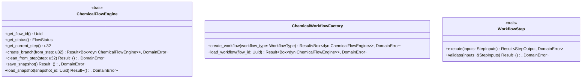
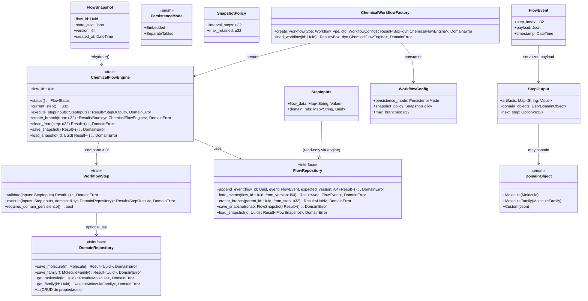

Posible diagrama de clases


hay que compeltar este diagrama hay que recordar si bien un paso de cada
flujo puede usar muchas familias y/o muchas moleculas independientes y/o mucha metadata no relacionada entre si si este genera moleculas
y/o familias estas deben guardarse en el repositorio de dominio
pero tambien hay que recordar que en el flujo debe estar
toda la informacion para rehidratar el estado de un flujo asi que si necesita
cosas del dominio estas deben hacer referencia a las mismmas por medio de metadata o identificadores


El objetivo es crear un nuevo crate `chem-workflow` que defina el trait `ChemicalFlowEngine` y implementaciones concretas como `CadmaFlow`. Este crate debería depender de `flow` para el `FlowRepository` y de `chem-domain` para los tipos de dominio, pero sin que `flow` dependa de `chem-workflow` para evitar ciclos.

La idea es que `ChemicalFlowEngine` use el `FlowRepository` para persistir los eventos del flujo, y cuando un paso genere datos de dominio, estos se persistan a través del `DomainRepository` (que está en `chem-domain`) o se incluyan en el `FlowData` según la configuración.
Ahora, respecto a la recuperación del estado: cuando se crea un

4. Para el modo separate_tables, el `ChemicalFlowEngine` necesitaría acceso a un `DomainRepository` para guardar los objetos de dominio por separado.

5. El `ChemicalFlowEngine` debería ser capaz de rehidratar su estado a partir de los eventos y los snapshots.


`ChemicalFlowEngine` existente (con `recovery`), debe leer los eventos desde el FlowRepository y aplicar cada evento para reconstruir el estado. Si hay snapshots, puede cargar el estado desde el snapshot y luego aplicar los eventos posteriores.

Para no forzar una dependencia de `chem-workflow` en `chem-domain`, el trait `ChemicalFlowEngine` no debería mencionar tipos específicos de dominio como `Molecule` o `MoleculeFamily`. En su lugar, los flujos concretos como `CadmaFlow` tendrían su propio estado que incluye estos tipos, pero el trait sería genérico.

1. Crear el crate `chem-workflow` que dependa de `flow` y `chem-domain`.
2. Definir el trait `ChemicalFlowEngine` en `chem-workflow` c

Para evitar confusiones, debemos separar claramente:
- La persistencia de los eventos del flujo (FlowRepository)
- La persistencia de los objetos de dominio (DomainRepository)
- El sistema debe ser genérico y no asumir que solo hay un tipo de flujo (CadmaFlow) con pasos fijos. Además, la recuperación del estado debe ser más explícita
# chem‑workflow – Arquitectura del motor de flujo químico

## 1. Objetivo

Crear el crate **`chem-workflow`** que proporcione:

* El trait **`ChemicalFlowEngine`** como núcleo de los motores de flujo químico.
* Implementaciones concretas (p.e. `CadmaFlow`).
* Soporte para branching, snapshots y rehidratación usando el `FlowRepository` del crate **`flow`**.
* Persistencia de objetos de dominio (moléculas, familias, metadata) mediante el `DomainRepository` del crate **`chem-domain`**, sin introducir ciclos de dependencia.

---

## 2. Restricciones del workspace

| Crate | API pública congelada | Motivo |
|-------|----------------------|--------|
| `flow` | `FlowRepository`, `FlowEngine`, snapshots, branching | Base de versionado de flujos. |
| `chem-domain` | Entidades (`Molecule`, `MoleculeFamily`, …) y `DomainRepository` | Modelo de dominio e invariantes. |
| `chem-persistence` | Implementaciones Diesel de `FlowRepository` y `DomainRepository` | Infraestructura de base de datos. |
| `chem-providers` | Wrappers externos (`ChemEngine`) | Acceso a cálculos externos. |

---

## 3. Dirección de dependencias (sin ciclos)

```
chem-workflow ──► flow
               └─► chem-domain
               └─► chem-persistence (solo los traits ya definidos)
flow          ──► (no depende de chem-workflow)
chem-domain   ──► (no depende de chem-workflow)
```

---

## 4. Estructura de carpetas (propuesta final)

```
chem-workflow/
├─ Cargo.toml
├─ src/
│   ├─ lib.rs                # re‑export público
│   ├─ mod.rs
│   ├─ engine/
│   │   ├─ mod.rs
│   │   └─ chemical_flow.rs   # trait ChemicalFlowEngine
│   ├─ factory/
│   │   ├─ mod.rs
│   │   └─ workflow_factory.rs   # struct ChemicalWorkflowFactory
│   ├─ step/
│   │   ├─ mod.rs
│   │   └─ trait.rs               # trait WorkflowStep
│   ├─ config/
│   │   ├─ mod.rs
│   │   └─ workflow_config.rs     # PersistenceMode, SnapshotPolicy, …
│   ├─ flows/
│   │   ├─ mod.rs
│   │   ├─ cadma_flow/
│   │   │   ├─ mod.rs
│   │   │   ├─ cadma_flow.rs      # impl. de ChemicalFlowEngine
│   │   │   ├─ state.rs           # struct CadmaState
│   │   │   └─ steps/
│   │   │       ├─ mod.rs
│   │   │       ├─ step1.rs
│   │   │       └─ step2.rs
│   │   └─ another_flow/ …        # plantilla para futuros flujos
│   └─ persistence/
│       ├─ mod│       └─ repo_adapter.rs         # adapters Flow↔Domain
└─ tests/
    ├─ integration.rs
    └─ unit/
        └─ cadma_flow.rs
```

### 4.1. Descripción de los módulos

| Módulo | Responsabilidad |
|--------|-----------------|
| `engine::chemical_flow.rs` | Trait `ChemicalFlowEngine` (IDs, estado, snapshots, branching). No conoce tipos de dominio. |
| `factory::workflow_factory.rs` | Crea (`create_workflow`) y carga (`load_workflow`) motores a partir de `WorkflowConfig`. |
| `step::trait.rs` | Trait `WorkflowStep` con `validate`, `execute` y `requires_domain_persistence`. |
| `config::workflow_config.rs` | Configuración declarativa: `PersistenceMode`, `SnapshotPolicy`, límite de ramas, … |
| `flows/*` | Implementaciones concretas. Cada flujo mantiene su propio *state* y sus pasos. |
| `persistence::repo_adapter.rs` | Lógica que, según `PersistenceMode`, persiste objetos de dominio dentro del evento o en tablas separadas. |

---

## 5. Diagrama de clases (Mermaid)



---

## 6. Componentes clave

| Componente | Función |
|------------|---------|
| **ChemicalFlowEngine** | Interfaz principal para cualquier motor de flujo químico. Gestiona IDs, estado, branching, snapshots y delega la ejecución a `WorkflowStep`. |
| **WorkflowStep** | Representa una unidad lógica del flujo. Puede validar, ejecutar y decidir si persiste objetos de dominio. |
| **ChemicalWorkflowFactory** | Encargada de crear y cargar motores según `WorkflowType` y `WorkflowConfig`. |
| **WorkflowConfig** | Configura modo de persistencia (`Embedded` / `SeparateTables`), política de snapshots y límite de ramas. |
| **FlowRepository** (externo) | Persiste eventos, snapshots y gestión de ramas. |
| **DomainRepository** (externo) | CRUD de entidades de dominio (`Molecule`, `MoleculeFamily`, …). |
| **CadmaFlow** (ejemplo) | Implementación concreta que mantiene `CadmaState` y define sus pasos (`step1`, `step2`, …). |
| **RepoAdapter** | Convierte `StepOutput` en `FlowEvent` según el modo de persistencia. |

---

## 7. Pasos de implementación

1. **Crear el crate**
   ```bash
   cargo new chem-workflow --lib
   # añadir al workspace:
   echo 'chem-workflow = { path = "crates/chem-workflow" }' >> Cargo.toml
   ```

2. **Agregar dependencias** (`chem-workflow/Cargo.toml`)
   ```toml
   [dependencies]
   uuid = { version = "1", features = ["serde", "v4"] }
   serde = { version = "1", features = ["derive"] }
   serde_json = "1"
   flow = { path = "../flow" }
   chem-domain = { path = "../chem-domain" }
   thiserror = "1"
   tracing = "0.1"
   ```

3. **Definir traits**
   * `engine/chemical_flow.rs` – `ChemicalFlowEngine`.
   * `step/trait.rs` – `WorkflowStep`.

4. **Implementar fábrica** (`factory/workflow_factory.rs`) – match sobre `WorkflowType` y devuelve `Box<dyn ChemicalFlowEngine>`.

5. **Implementar CadmaFlow**
   * `state.rs` – estructura `CadmaState { current_step: u32, domain_refs: Vec<Uuid>, metadata: Value }`.
   * `cadma_flow.rs` – implementación del trait, inyección de `Arc<dyn FlowRepository>` y `Arc<dyn DomainRepository>`.
   * `steps/stepX.rs` – lógica de cada paso (validación, posible persistencia en `DomainRepository generación de `StepOutput`).

6. **Persistencia de outputs** (`persistence/repo_adapter.rs`) – función que, según `PersistenceMode`, guarda los objetos de dominio dentro del JSON del evento o los persiste por separado.

7. **Snapshots**
   * `save_snapshot` serializa `self.state` con `serde_json` y delega a `FlowRepository::save_snapshot`.
   * `load_snapshot` deserializa y restaura el estado interno.

8. **Branching** – `create_branch` delega a `FlowRepository::create_branch` y devuelve una nueva instancia del motor apuntando al nuevo `flow_id`.

9. **Testing**
   * **Unit** – cada paso probada con repositorios en memoria.
   * **Integration** – flujo completo: crear, ejecutar pasos, crear rama, snapshot, rehidratar y validar el estado final.

10. **Documentación** (`README.md` del crate)
    * Diagrama de arquitectura.
    * Guía de “quick‑start”.
    * Explicación de `PersistenceMode` y `SnapshotPolicy`.
    * Ejemplo completo de uso de la fábrica y ejecución de pasos.

11. **CI** – Añadir el crate al pipeline `cargo test --workspace` y a la cobertura de código.

---

## 8. Buenas prácticas

| Tema | Recomendación |
|------|----------------|
| **Inyección de dependencias** | Constructor `new(repo: Arc<dyn FlowRepository>, domain: Arc<dyn DomainRepository>, cfg: WorkflowConfig)`. |
| **Manejo de errores** | Un único enum `DomainError` que englobe `FlowError`, `RepositoryError` y `StepError` usando `thiserror`. |
| **Serialización** | Todas las structs de estado, inputs y outputs con `#[derive(Serialize, Deserialize)]` y `#[serde(default)]` para compatibilidad futura. |
| **Feature flags** | Cada flujo concreto bajo una feature (`cadma`, `another`) para evitar código innecesario en binarios que no lo usan. |
| **Registro dinámico de pasos** (opcional) | `once_cell::sync::Lazy<HashMap<String, fn() -> Box<dyn WorkflowStep>>>` para extensibilidad sin tocar `chem-workflow`. |
| **Logging/Tracing** | `tracing` con spans `flow_id` y `step_index`. |
| **Versionado** | Cambios que rompan el trait son `MAJOR`; añadir métodos opcionales es `MINOR`. |
| **Documentación de dependencias** | Tabla en la raíz del workspace que muestra la dirección de dependencias (sección 3). |

---

## 9. Resultado esperado

* Motor de flujo químico desacoplado y extensible.
* Persistencia flexible (JSON incrustado o tablas separadas).
* Snapshots y branching gestionados por `flow` sin modificar su código.
* Pruebas unitarias e integradas fáciles gracias a la inyección de repositorios en memoria.
* Sin ciclos de dependencia y cumplimiento de SOLID (SRP, DIP, OCP).

---
