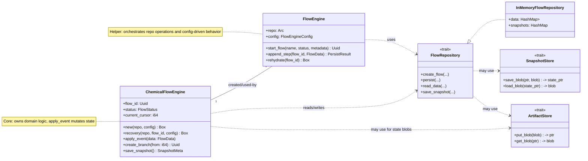

# Diagrama y Checklist para integrar CadmaFlow con el sistema actual


Notas:

- `new` y `recovery` son funciones asociadas que devuelven el tipo `Box<dyn ChemicalFlowEngine>`; cada implementación puede devolver su tipo concreto.
- Cada flujo implementará la serialización del `state` en su propio formato (JSON, CBOR, etc.) y usará `FlowRepository`/`SnapshotStore` para persistirlo.

(`crates/flow` + `chem-persistence` + `chem-domain`). Está orientado a ser
acciónable: cada ítem apunta a archivos existentes y a pruebas a agregar.

## Resumen de objetivos

- Integrar `CadmaFlow` como un flujo concreto que use el trait `FlowRepository`.
- Garantizar rehidratación robusta por snapshot + replay.
- Soportar branching desde un cursor (crear flows hijos).
- Mantener idempotencia (soporte `command_id`) y detección de conflictos por `expected_version`.
- Usar `InMemoryFlowRepository` para pruebas rápidas y `chem-persistence` para integración.

## Persistencia opcional de familias y moléculas por paso

Requisito: algunos pasos del flujo pueden generar datos del dominio químico —por ejemplo, una o varias `Molecule` o `MoleculeFamily`— y estos objetos deben poder persistirse junto con el paso (o referenciarse desde él) cuando existan. No todos los pasos generarán estos datos; la persistencia debe ser opcional y configurable.

Objetivos concretos:

- Permitir que un `FlowData` incluya, opcionalmente, objetos de dominio serializados (por ejemplo: `molecules`, `families`, `properties`) o referencias a blobs/artefactos que los almacenen fuera de la tabla `flow_data`.
- Ofrecer tres modos de persistencia configurables:
  1. inline: serializar los objetos de dominio dentro del `payload`/`metadata` (JSON) de `flow_data`.
  2. artifact: guardar los objetos como blobs (ArtifactStore) y en `flow_data` dejar solo un puntero `artifact_ptr`.
  3. separate_tables: persistir en tablas separadas enlazadas por `flow_id` y `cursor` (ej.: `flow_molecules`, `flow_families`) para poder consultarlas/filtrarlas eficientemente.

Recomendación de diseño (no excluyente): extender el tipo `FlowData` para admitir un campo opcional `domain_objects: Option<serde_json::Value>` o un DTO `DomainObjects { molecules: Option<Vec<MoleculeDto>>, families: Option<Vec<FamilyDto>>, ... }`. Esto mantiene compatibilidad y permite que repositorios implementen la política elegida.

Implicaciones para `chem-persistence` (migraciones / schema):

- Opción rápida: añadir una columna JSON `domain_objects` en `flow_data` (aceptable para SQLite/Postgres). Ventaja: mínimo cambio de API. Archivo: `crates/chem-persistence/migrations/...` y `schema.rs`.
- Opción robusta: añadir tablas `flow_molecules` y `flow_families` con columnas mínimas: `id, flow_id, cursor, entity_id, payload_json, created_at_ts`. Ventaja: consultas y joins eficientes, menos carga sobre `flow_data`.
- Alternativa (artifact): implementar `ArtifactStore` en `chem-persistence` y usar `snapshots`/`artifacts` para blobs grandes; guardar `artifact_ptr` dentro de `flow_data.metadata`.

Cambios sugeridos en API (pasos accionables):

1. `crates/flow/src/domain.rs`:
  - añadir `pub struct DomainObjects { molecules: Option<serde_json::Value>, families: Option<serde_json::Value> }` o, más simple, `pub domain_objects: Option<serde_json::Value>` dentro de `FlowData`.

2. `crates/flow/src/repository.rs` (trait `FlowRepository`):
  - documentar que `persist(...)` puede recibir `FlowData` con `domain_objects` y debe persistirlo según la política configurada.
  - (opcional) extender la firma: `persist_with_domain(flow_id, expected_version, FlowData, Option<DomainObjects>) -> PersistResult` si se prefiere separar explícitamente.

3. `crates/flow/src/stubs.rs` (InMemory):
  - almacenar `domain_objects` en memoria junto con cada `FlowData` para tests.

4. `crates/chem-persistence/`:
  - decidir modo (inline / artifact / separate_tables) y añadir migración. Para empezar rápido recomendamos agregar la columna `domain_objects TEXT` (JSON) en la migración `00000000000001_create_schema/up.sql` y reflejarla en `schema.rs`.
  - si se opta por tablas separadas, añadir migraciones para `flow_molecules` y `flow_families`.

5. `crates/flow/src/engine.rs` (`FlowEngineConfig`): añadir opciones de configuración:
  - `persist_domain_objects: bool` (default: false)
  - `persist_domain_mode: String` enum-like ("inline" | "artifact" | "separate_tables")
  - `domain_artifact_store: Option<Arc<dyn ArtifactStore>>` (si aplica)

6. Ejemplos y tests:
  - actualizar `crates/flow/examples/flow_simple_usage.rs` y `crates/chem-persistence/examples/persistence_simple_usage.rs` para mostrar cómo un paso incluye `molecules` o `families` en su payload y cómo se persisten según la configuración.
  - añadir tests en `crates/flow/tests/` que verifiquen:
    * persistencia inline: `flow_data` contiene `domain_objects` después de `persist`;
    * persistencia artifact: `flow_data` contiene `artifact_ptr` y `ArtifactStore` devuelve el blob esperado;
    * persistencia separate_tables: `flow_molecules` / `flow_families` contienen las entradas con `cursor` correcto.

Mapping con `chem-domain`:

- Cuando se persistan objetos de dominio, serializarlos usando los DTO/structs de `crates/chem-domain` (p. ej. `Molecule`, `MoleculeFamily`, `OwnedFamilyProperty`, `OwnedMolecularProperty`) vía serde. Esto evita duplicar formatos y permite reusar validación/métodos de los tipos existentes.
- Al leer `domain_objects` durante `recovery`, deserializar a los tipos de `chem-domain` y aplicar al estado del flujo (por ejemplo, `CadmaState::add_molecule(...)`).


Checklist corto (acción inmediata)

- [ ] Actualizar `crates/flow/src/domain.rs` para añadir `domain_objects` opcional en `FlowData`.
- [ ] Documentar comportamiento esperado en `crates/flow/src/repository.rs` (persist con domain_objects).
- [ ] Modificar `crates/flow/src/stubs.rs` para que `InMemoryFlowRepository` guarde `domain_objects`.
- [ ] Añadir columna `domain_objects` (JSON/TEXT) a `crates/chem-persistence/migrations/00000000000001_create_schema/up.sql` y a `schema.rs` (o crear tablas `flow_molecules` / `flow_families`).
- [ ] Añadir opciones a `FlowEngineConfig` y usar `persist_domain_objects` en `FlowEngine::append_step` / helpers.
- [ ] Actualizar ejemplos (`flow_simple_usage.rs`, `persistence_simple_usage.rs`) y añadir tests que demuestren los tres modos de persistencia.

Notas finales: este cambio añade flexibilidad para que los pasos que generan datos del dominio los guarden junto al flujo sin forzar que todos los pasos lo hagan. Recomiendo empezar por la estrategia "inline" (columna JSON) para minimizar cambios y acelerar pruebas; luego, si aparecen problemas de tamaño o rendimiento, migrar a `artifact` o `separate_tables`.

Nota nueva: el sistema debe ser genérico y no asumir un único tipo de flujo ni pasos fijos. Cada flujo puede definir su propio estado y su propia lógica de rehidratación.

El documento se reescribe para introducir un trait genérico `ChemicalFlowEngine` y un contrato de recuperación explícito.

## Mapeo directo al workspace (qué ya existe)

- `crates/flow/src/domain.rs` — tipos: `FlowData`, `FlowMeta`, `SnapshotMeta`, `PersistResult`, `WorkItem`.
- `crates/flow/src/repository.rs` — trait `FlowRepository`, `SnapshotStore`, `ArtifactStore`.
- `crates/flow/src/engine.rs` — helpers del `FlowEngine` (rehidratación, start_flow, get_items, save_snapshot).
- `crates/flow/src/stubs.rs` — `InMemoryFlowRepository`, `InMemoryWorkerPool`, `GateService` (para tests y ejemplos).
- `crates/chem-persistence/` — implementación Diesel del repo, migraciones y ejemplos.
- `crates/chem-domain/` — tipos del dominio químico (molecule, families, DomainError).

## Contrato reducido (FlowRepository y FlowEngine)

- FlowRepository (métodos mínimos esperados):

  - create_flow(name, status, metadata) -> Uuid
  - create_branch(parent_flow_id, name, status, from_cursor, metadata) -> Uuid
  - persist(flow_id, expected_version, `FlowData`) -> `PersistResult`
  - read_data(flow_id, from_cursor) -> `Vec<FlowData>`
  - save_snapshot(flow_id, cursor, state_ptr, metadata) -> `SnapshotMeta`
  - read_snapshot(flow_id) -> `Option<SnapshotMeta>`

- FlowEngine (helpers que ya existen o deben existir claramente):
  - start_flow(name, status, metadata) -> Uuid
  - append_step(flow_id, key, payload, command_id?) -> PersistResult
  - get_items(flow_id, from_cursor) -> `Vec<FlowData>`
  - create_branch(flow_id, from_cursor, name, status, metadata) -> Uuid
  - save_snapshot(flow_id) -> SnapshotMeta
  - rehydrate(flow_id) -> loads snapshot + replays events

## Nuevo: trait genérico `ChemicalFlowEngine`

Propósito: permitir que cada flujo implemente su propio estado, pasos y
rehidratación. El trait define las operaciones comunes y deja a la
implementación la responsabilidad de serializar/deserializar su estado.

```rust
// crates/chem-workflow/src/lib.rs (propuesta)
use async_trait::async_trait;
use chem_domain::DomainError;
use flow::repository::FlowRepository;
use serde_json::Value;
use uuid::Uuid;

#[derive(Debug, Clone, PartialEq)]
pub enum FlowStatus { Created, Running, Completed, Failed, Paused, Branching }

#[async_trait]
pub trait ChemicalFlowEngine: Send + Sync {
    fn get_flow_id(&self) -> Uuid;
    fn get_status(&self) -> FlowStatus;
    fn get_current_step(&self) -> i64;

    // Crear un flujo nuevo (genera UUID internamente)
    fn new(repo: std::sync::Arc<dyn FlowRepository>) -> Result<Box<dyn ChemicalFlowEngine>, DomainError>;

    // Recuperar (rehidratar) desde persistencia
    fn recovery(repo: std::sync::Arc<dyn FlowRepository>, flow_id: Uuid) -> Result<Box<dyn ChemicalFlowEngine>, DomainError>;

    async fn create_branch(&self, from_step: i64, branch_name: Option<String>) -> Result<Box<dyn ChemicalFlowEngine>, DomainError>;
    async fn clean_from_step(&mut self, step: i64) -> Result<(), DomainError>;
    async fn save_snapshot(&self) -> Result<(), DomainError>;
    async fn load_snapshot(&mut self, snapshot_id: Uuid) -> Result<(), DomainError>;
}
```

Notas:

- `new` y `recovery` son funciones asociadas que devuelven el tipo `Box<dyn ChemicalFlowEngine>`; cada implementación puede devolver su tipo concreto.
- Cada flujo implementará la serialización del `state` en su propio formato (JSON, CBOR, etc.) y usará `FlowRepository`/`SnapshotStore` para persistirlo.

## Recuperación de estado: contract explícito

1. La implementación concreta de `ChemicalFlowEngine::recovery` debe:

   - leer `SnapshotMeta` más reciente para `flow_id` mediante `FlowRepository::read_snapshot` o `SnapshotStore`;
   - si existe snapshot: cargar el blob referenciado por `state_ptr` desde `ArtifactStore` (o un campo `state` si está embebido), y deserializar al tipo de estado propio del flujo;
   - leer `FlowData` con `read_data(flow_id, snapshot.cursor)` y aplicar en orden las entradas posteriores al cursor usando un método `apply_event` propio del flujo;
   - si no existe snapshot: empezar desde estado vacío y leer todo el `FlowData` desde cursor 0 y aplicar.

2. Garantías:
   - El flujo concreto controla cómo aplicar un `FlowData` al estado; el framework solo garantiza orden, lectura y entrega de eventos.
   - El `command_id` y `expected_version` se manejan a nivel de `FlowRepository` para idempotencia y detección de conflictos.

## Diagramas actualizados

# Núcleo: ChemicalFlowEngine — Documento de diseño y checklist

Este documento está reordenado para dejar claro que el elemento nuclear es el trait `ChemicalFlowEngine`. Todo lo demás (repositorios, snapshots, persistencia de datos de dominio) se organiza alrededor de él.

Objetivo principal

- Definir un contrato claro (trait) que permita implementar flujos concretos (p. ej. CadmaFlow). El trait debe expresar:
  - creación y recuperación (new / recovery),
  - rehidratación desde snapshot + replay,
  - branching y limpieza desde un cursor,
  - operaciones de snapshot y serialización del estado.

Diseño resumido y contrato sugerido

- El trait `ChemicalFlowEngine` vive en `crates/flow/src/traits.rs` y se exporta desde `crates/flow/src/lib.rs`.
- Recomendación (esquema mínimo):

  - get_flow_id() -> Uuid
  - get_status() -> FlowStatus
  - get_current_step() -> i64
  - associated fn new(repo: Arc<dyn FlowRepository>, config: FlowEngineConfig) -> Result<Box<dyn ChemicalFlowEngine>, DomainError>
  - associated fn recovery(repo: Arc<dyn FlowRepository>, flow_id: Uuid, config: FlowEngineConfig) -> Result<Box<dyn ChemicalFlowEngine>, DomainError>
  - fn apply_event(&mut self, data: &FlowData) -> Result<(), DomainError>
  - async fn create_branch(&self, from_step: i64, name: Option<String>) -> Result<Uuid, DomainError>
  - fn save_snapshot(&self) -> Result<SnapshotMeta, DomainError>

- Notas:
  - `new` y `recovery` son funciones asociadas para obtener el objeto concreto (boxed). Esto permite que implementaciones devuelvan tipos concretos empaquetados.
  - `apply_event` es clave: define cómo un `FlowData` muta el `state` interno del flujo.

Responsabilidades separadas

- FlowRepository / SnapshotStore / ArtifactStore: responsable de durabilidad, transacciones y punteros a blobs.
- FlowEngine (helpers): utilidades reusables (start_flow, append_step, read items, crear branch), pueden delegar en una implementación concreta de `ChemicalFlowEngine` para aplicar lógica de dominio.

Persistencia de objetos de dominio por paso (Molecules / Families)

- Requisito: algunos pasos generan objetos de dominio (moléculas, familias). Persistirlos debe ser opcional y configurable.
- Modos disponibles:
  1. inline: serializar en `flow_data.domain_objects` (JSON). Rápido de implementar.
 2. artifact: guardar blob en `ArtifactStore` y en `flow_data` poner `artifact_ptr`.
 3. separate_tables: tablas `flow_molecules` / `flow_families` con relación a `flow_id` y `cursor`.

- Recomendación inicial: empezar con `inline` (columna JSON) para validar la integración y tests. Luego, migrar a `artifact` o `separate_tables` si hay problemas de tamaño o consultas.

Mapping con `chem-domain`

- Usar los DTO/structs existentes (`Molecule`, `MoleculeFamily`, `OwnedFamilyProperty`, `OwnedMolecularProperty`) para serializar/deserializar mediante serde.
- Al rehidratar, deserializar `domain_objects` y pasar/inyectar esas entidades al estado del flujo (metodo `apply_event` o helpers específicos del flujo).

Checklist priorizado (centrado en ChemicalFlowEngine)

Prioridad Alta (implementar y asegurar el núcleo)

1) Crear `traits.rs` y exponer el trait
  - Archivo: `crates/flow/src/traits.rs` — definir `ChemicalFlowEngine` (signature mínima arriba).
  - Editar `crates/flow/src/lib.rs` para reexportar el trait.

2) Implementar `apply_event` como obligación del trait
  - Refactor: mover/extraer `apply_event` de ejemplos hacia el trait; documentar su contrato (puro, sin efectos secundarios largos).

3) FlowEngine helpers que dependen del trait
  - `FlowEngine::new(repo, config)` y helpers (start_flow, append_step) deben aceptar config que describa cómo persistir `domain_objects`.
  - `FlowEngine` puede ser una fábrica ligera que delega en la implementación concreta del `ChemicalFlowEngine` para la lógica de rehidratación y aplicación de eventos.

4) InMemory repo + tests básicos
  - `InMemoryFlowRepository` debe almacenar el nuevo campo `domain_objects` y soportar lectura/escritura para tests.
  - Tests: rehidratación básica, persist inline de domain objects.

Prioridad Media (durabilidad y migraciones)

5) `chem-persistence` (migración mínima)
  - Añadir columna `domain_objects TEXT` (JSON) a `flow_data` en la migración inicial para permitir el modo inline.
  - Reflejar el cambio en `schema.rs` y en el código Diesel.

6) ArtifactStore / separate_tables (si se requiere)
  - Si se prevén blobs grandes, implementar `ArtifactStore` y cambiar `persist` para guardar pointer en `flow_data`.
  - Alternativamente, crear tablas `flow_molecules` / `flow_families` con `flow_id`, `cursor`, `entity_id`, `payload_json`.

Prioridad Baja (ergonomía y docs)

7) Documentación y ejemplos
  - Actualizar `crates/flow/README.md` y `crates/chem-persistence/README.md` con ejemplos cortos.
  - Actualizar `crates/flow/examples/flow_simple_usage.rs` para mostrar cómo adjuntar `molecules` en un paso.

8) Tests avanzados
  - Test de contract rehidratación (snapshot + replay), idempotencia y conflict.

Ficheros objetivo (resumen rápido)

- `crates/flow/src/traits.rs` — nuevo trait `ChemicalFlowEngine`.
- `crates/flow/src/lib.rs` — exportar trait.
- `crates/flow/src/domain.rs` — añadir `domain_objects: Option<serde_json::Value>` en `FlowData` (inicialmente).
- `crates/flow/src/stubs.rs` — `InMemoryFlowRepository` almacenar `domain_objects`.
- `crates/flow/src/engine.rs` — aceptar `FlowEngineConfig` con opciones `persist_domain_objects` y `persist_domain_mode`.
- `crates/chem-persistence/migrations/00000000000001_create_schema/up.sql` — añadir `domain_objects TEXT` (opcional, para inline mode).
- `crates/chem-persistence/src/schema.rs` — reflejar la nueva columna.

Prueba rápida recomendada (smoke)

1. Implementar cambio mínimo (inline): `FlowData` + `InMemoryFlowRepository` + ejemplo que persiste `molecules` en payload.
2. Ejecutar tests unitarios en `crates/flow/tests` que verifican que `persist` guarda `domain_objects` y `recovery` los aplica.

Decisiones clave y razones

- Centrar el diseño en un trait facilita múltiples implementaciones (CadmaFlow, otros) y mantiene claro el límite entre almacenamiento y lógica de dominio.
- Empezar con inline reduce el trabajo inicial y permite validar la semántica antes de introducir artefact stores o tablas separadas.

Siguientes pasos que propongo ahora

1. Confirmas que quieres que implemente los cambios mínimos (A: inline) y lo hago: crear `traits.rs`, modificar `FlowData`, actualizar `InMemoryFlowRepository`, añadir migración SQL y tests básicos.
2. O, si prefieres, implemento solo la documentación/README (menos invasivo) y dejamos la implementación para después.

-- Fin del documento reorganizado centrado en `ChemicalFlowEngine`.

## Diagramas detallados

Abajo incluyo dos diagramas Mermaid: uno de clases (focalizado en `ChemicalFlowEngine` y sus colaboradores) y otro de flujo (rehidratación + persistencia de un paso que contiene domain objects). Cada diagrama va acompañado de una breve explicación y notas de lectura.

### Diagrama de clases (Mermaid)



Lectura del diagrama de clases

- `ChemicalFlowEngine` es la pieza central que contiene la lógica de dominio y el estado del flujo (por ejemplo `CadmaState`).
- `FlowEngine` es un helper/factory que conoce el `FlowRepository` y la `FlowEngineConfig`.
- `FlowRepository` es un contrato; `InMemoryFlowRepository` es una implementación concreta usada en tests. `ArtifactStore`/`SnapshotStore` son opcionales y se usan para blobs grandes.

### Diagrama de flujo (rehidratación y persistencia de pasos)

```mermaid
flowchart TD
  subgraph Persist
    A[Client executes command] --> B{Has command_id?}
    B -->|yes| C[Check idempotency in repo]
    B -->|no| D[Proceed to persist]
    C -->|duplicate| E[Return Duplicate]
    C -->|new| D
    D --> F[Build FlowData (may include domain objects)]
    F --> G{persist_domain_mode}
    G -->|inline| H[Store domain_objects in flow_data JSON]
    G -->|artifact| I[Put blob in ArtifactStore and store ptr]
    G -->|separate_tables| J[Insert rows in flow_molecules / flow_families]
    H --> K[Repo persist]
    I --> K
    J --> K
    K --> L[Return PersistResult]
  end

  subgraph Rehydrate
    M[Start recovery] --> N{Snapshot exists?}
    N -->|yes| O[Load state blob or embedded state]
    N -->|no| P[Create empty state]
    O --> Q[Set state and cursor]
    P --> Q
    Q --> R[Read FlowData from repo (cursor..end)]
    R --> S[For each FlowData call apply_event]
    S --> T[State ready]
  end

  L --> U[Client receives result]
  T --> V[Engine continues processing]

  style Persist fill:#f9f,stroke:#333,stroke-width:1px
  style Rehydrate fill:#9ff,stroke:#333,stroke-width:1px
```

Notas sobre el diagrama de flujo

- La rama `Persist` muestra cómo el motor decide el modo de persistencia para `domain_objects` y asegura idempotencia mediante `command_id` verificado por el repositorio.
- La rama `Rehydrate` muestra cómo se reconstruye el estado: snapshot (si existe) + replay de eventos posteriores. Durante el replay, `apply_event` puede recibir `domain_objects` ya deserializados y añadirlos al estado.

Cómo usar estos diagramas

- Copia las secciones Mermaid a cualquier visor compatible (GitHub, VSCode Mermaid Preview) para visualizar los diagramas.
- Úsalos como base para el diseño de `traits.rs`, la implementación de `InMemoryFlowRepository` y las migraciones en `chem-persistence`.

Estado de la tarea: diagramas creados

- Marcaré la tarea `Crear diagramas detallados` como completada en el TODO list y reanudaré la verificación de referencias al trait si quieres que continúe.
