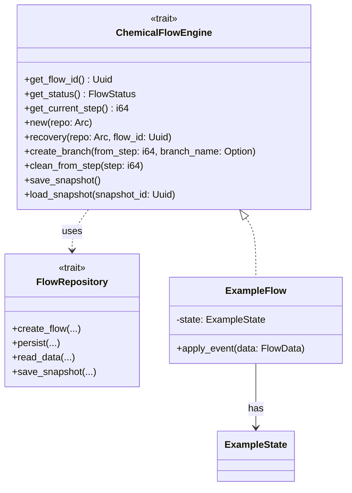
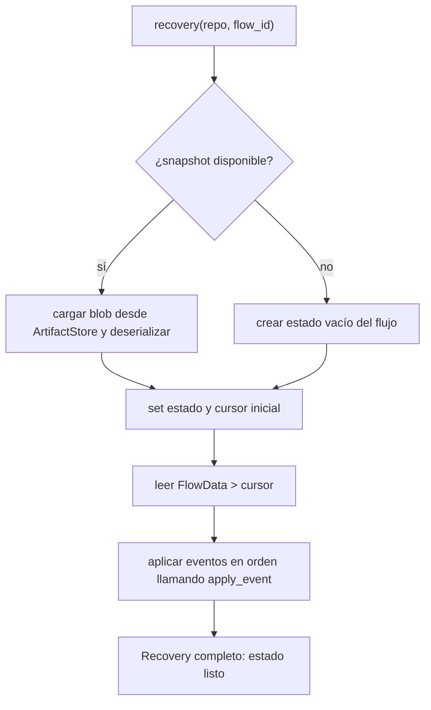
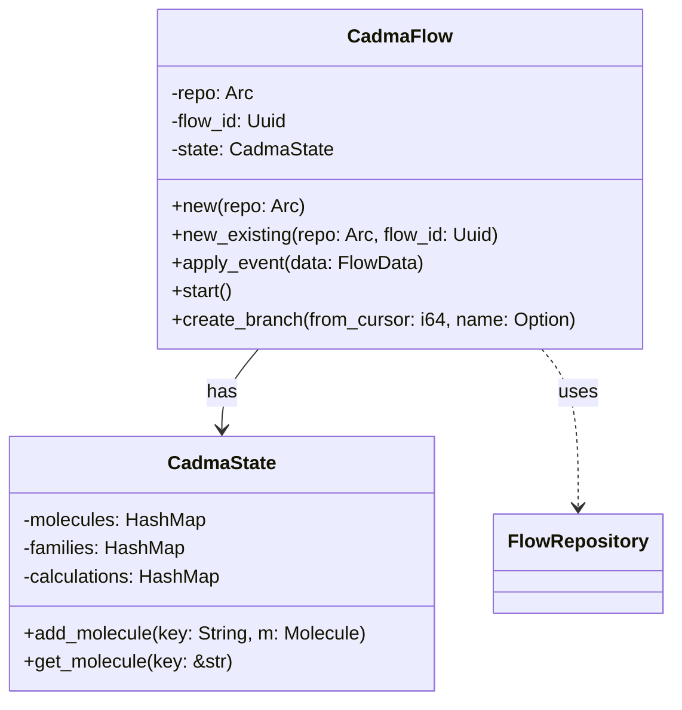
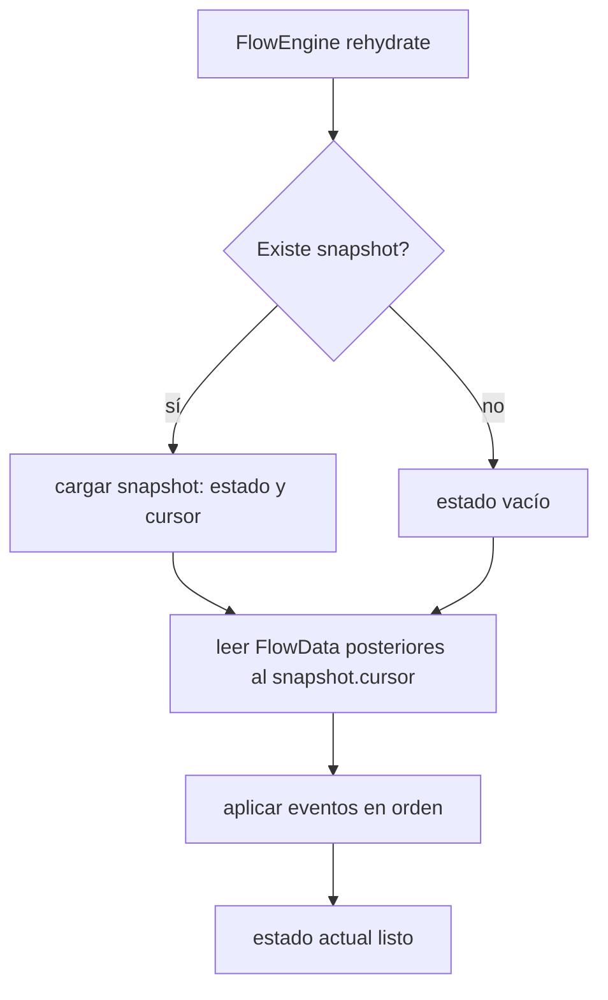

# Diagrama y Checklist para integrar CadmaFlow con el sistema actual

}

Notas:

- `new` y `recovery` son funciones asociadas que devuelven el tipo `Box<dyn ChemicalFlowEngine>`; cada implementación puede devolver su tipo concreto.
- Cada flujo implementará la serialización del `state` en su propio formato (JSON, CBOR, etc.) y usará `FlowRepository`/`SnapshotStore` para persistirlo.

(`crates/flow` + `chem-persistence` + `chem-domain`). Está orientado a ser
acciónable: cada ítem apunta a archivos existentes y a pruebas a agregar.

## Resumen de objetivos

- Integrar `CadmaFlow` como un flujo concreto que use el trait `FlowRepository`.
- Garantizar rehidratación robusta por snapshot + replay.
- Soportar branching desde un cursor (crear flows hijos).
- Mantener idempotencia (soporte `command_id`) y detección de conflictos por `expected_version`.
- Usar `InMemoryFlowRepository` para pruebas rápidas y `chem-persistence` para integración.

Nota nueva: el sistema debe ser genérico y no asumir un único tipo de flujo ni pasos fijos. Cada flujo puede definir su propio estado y su propia lógica de rehidratación.

El documento se reescribe para introducir un trait genérico `ChemicalFlowEngine` y un contrato de recuperación explícito.

## Mapeo directo al workspace (qué ya existe)

- `crates/flow/src/domain.rs` — tipos: `FlowData`, `FlowMeta`, `SnapshotMeta`, `PersistResult`, `WorkItem`.
- `crates/flow/src/repository.rs` — trait `FlowRepository`, `SnapshotStore`, `ArtifactStore`.
- `crates/flow/src/engine.rs` — helpers del `FlowEngine` (rehidratación, start_flow, get_items, save_snapshot).
- `crates/flow/src/stubs.rs` — `InMemoryFlowRepository`, `InMemoryWorkerPool`, `GateService` (para tests y ejemplos).
- `crates/chem-persistence/` — implementación Diesel del repo, migraciones y ejemplos.
- `crates/chem-domain/` — tipos del dominio químico (molecule, families, DomainError).

## Contrato reducido (FlowRepository y FlowEngine)

- FlowRepository (métodos mínimos esperados):

  - create_flow(name, status, metadata) -> Uuid
  - create_branch(parent_flow_id, name, status, from_cursor, metadata) -> Uuid
  - persist(flow_id, expected_version, `FlowData`) -> `PersistResult`
  - read_data(flow_id, from_cursor) -> `Vec<FlowData>`
  - save_snapshot(flow_id, cursor, state_ptr, metadata) -> `SnapshotMeta`
  - read_snapshot(flow_id) -> `Option<SnapshotMeta>`

- FlowEngine (helpers que ya existen o deben existir claramente):
  - start_flow(name, status, metadata) -> Uuid
  - append_step(flow_id, key, payload, command_id?) -> PersistResult
  - get_items(flow_id, from_cursor) -> `Vec<FlowData>`
  - create_branch(flow_id, from_cursor, name, status, metadata) -> Uuid
  - save_snapshot(flow_id) -> SnapshotMeta
  - rehydrate(flow_id) -> loads snapshot + replays events

## Nuevo: trait genérico `ChemicalFlowEngine`

Propósito: permitir que cada flujo implemente su propio estado, pasos y
rehidratación. El trait define las operaciones comunes y deja a la
implementación la responsabilidad de serializar/deserializar su estado.

```rust
// crates/chem-workflow/src/lib.rs (propuesta)
use async_trait::async_trait;
use chem_domain::DomainError;
use flow::repository::FlowRepository;
use serde_json::Value;
use uuid::Uuid;

#[derive(Debug, Clone, PartialEq)]
pub enum FlowStatus { Created, Running, Completed, Failed, Paused, Branching }

#[async_trait]
pub trait ChemicalFlowEngine: Send + Sync {
    fn get_flow_id(&self) -> Uuid;
    fn get_status(&self) -> FlowStatus;
    fn get_current_step(&self) -> i64;

    // Crear un flujo nuevo (genera UUID internamente)
    fn new(repo: std::sync::Arc<dyn FlowRepository>) -> Result<Box<dyn ChemicalFlowEngine>, DomainError>;

    // Recuperar (rehidratar) desde persistencia
    fn recovery(repo: std::sync::Arc<dyn FlowRepository>, flow_id: Uuid) -> Result<Box<dyn ChemicalFlowEngine>, DomainError>;

    async fn create_branch(&self, from_step: i64, branch_name: Option<String>) -> Result<Box<dyn ChemicalFlowEngine>, DomainError>;
    async fn clean_from_step(&mut self, step: i64) -> Result<(), DomainError>;
    async fn save_snapshot(&self) -> Result<(), DomainError>;
    async fn load_snapshot(&mut self, snapshot_id: Uuid) -> Result<(), DomainError>;
}
```

Notas:

- `new` y `recovery` son funciones asociadas que devuelven el tipo `Box<dyn ChemicalFlowEngine>`; cada implementación puede devolver su tipo concreto.
- Cada flujo implementará la serialización del `state` en su propio formato (JSON, CBOR, etc.) y usará `FlowRepository`/`SnapshotStore` para persistirlo.

## Recuperación de estado: contract explícito

1. La implementación concreta de `ChemicalFlowEngine::recovery` debe:

   - leer `SnapshotMeta` más reciente para `flow_id` mediante `FlowRepository::read_snapshot` o `SnapshotStore`;
   - si existe snapshot: cargar el blob referenciado por `state_ptr` desde `ArtifactStore` (o un campo `state` si está embebido), y deserializar al tipo de estado propio del flujo;
   - leer `FlowData` con `read_data(flow_id, snapshot.cursor)` y aplicar en orden las entradas posteriores al cursor usando un método `apply_event` propio del flujo;
   - si no existe snapshot: empezar desde estado vacío y leer todo el `FlowData` desde cursor 0 y aplicar.

2. Garantías:
   - El flujo concreto controla cómo aplicar un `FlowData` al estado; el framework solo garantiza orden, lectura y entrega de eventos.
   - El `command_id` y `expected_version` se manejan a nivel de `FlowRepository` para idempotencia y detección de conflictos.

## Diagramas actualizados

### Diagrama de clases genérico



### Diagrama de recuperación (mejorado)



## Estructura de carpetas recomendada (más genérica)

```text
crates/
├─ flow/                 # Framework base (domain, repository, engine helpers, stubs)
│  ├─ src/
│  │  ├─ domain.rs       # FlowData, FlowMeta, SnapshotMeta, PersistResult
│  │  ├─ repository.rs   # FlowRepository, SnapshotStore, ArtifactStore
│  │  ├─ engine.rs       # FlowEngine helpers y utilities
│  │  ├─ stubs.rs        # InMemoryFlowRepository, worker pool, gate service
│  │  └─ traits.rs       # trait ChemicalFlowEngine (genérico)
├─ chem-workflow/        # Implementaciones concretas de flujos (Ej: CadmaFlow)
│  ├─ cadma/             # CadmaFlow impl
│  │  ├─ mod.rs
│  │  ├─ cadma_flow.rs
│  │  └─ cadma_state.rs
│  └─ reaction/          # Otra implementación de flujo
└─ chem-persistence/     # Implementación Diesel del repositorio y stores
```

## Checklist actualizado (acciónable)

Alto (imprescindible)

1. Añadir `traits.rs` en `crates/flow/src/traits.rs` con `ChemicalFlowEngine` (ver propuesta arriba).
2. Mover/implementar `recovery` y `new` como funciones asociadas en el trait contract (o helpers en `engine.rs`) para que cada flujo pueda optar por su estrategia de rehidratación.
3. Refactor: extraer `apply_event` como método requerido por cada implementación de flujo (por ejemplo, `CadmaFlow::apply_event(&mut self, data: &FlowData)`).
4. Implementar un ejemplo `CadmaFlow` bajo `crates/chem-workflow/cadma/` que implemente `ChemicalFlowEngine` y demuestre:
   - creación (`new`),
   - persistencia de pasos (`persist` por medio del repo),
   - `recovery` desde snapshot + replay.

Medio

- Implementar `ArtifactStore` en `chem-persistence` para almacenar blobs de estado y permitir `save_snapshot` y `load_snapshot` eficientes.
- Añadir tests que verifiquen contract de `recovery` por flujo concreto.

Bajo

- Documentación extendida y ejemplos en `README.md` de cada crate.

## Tests recomendados

- Test genérico de contract: cualquier `ChemicalFlowEngine` implementado debe pasar un test que:

  1. cree un flujo, agregue N eventos,
  2. guarde snapshot,
  3. agregue M eventos adicionales,
  4. haga `recovery` y compare estado con el esperado.

- Test de idempotencia y conflicto como antes.

## Opciones y próximos pasos

Puedo:

- (A) Añadir `crates/flow/src/traits.rs` con el trait `ChemicalFlowEngine` propuesto y actualizar `crates/flow/src/lib.rs` para exportarlo. (rápido)
- (B) Implementar un `CadmaFlow` mínimo que implemente ese trait bajo `crates/chem-workflow/cadma/` y añadir tests de recovery (más trabajo, lo puedo hacer en esta sesión).
- (C) Actualizar `crates/flow/README.md` y `crates/chem-workflow/README.md` con la nueva semántica.

Indica si quieres que empiece con A, B o C y lo implemento.

## Diagrama simplificado (claro y parseable)

### Diagrama de Clases (resumido)



### Diagrama de rehidratación (flow)



## Checklist de implementación para asegurar funcionamiento de CadmaFlow

Prioridad alta (bloqueantes para integración completa):

1. (code) CadmaFlow constructor y rehydrate

   - Implementar `CadmaFlow::new_existing(repo, flow_id)` que:
     - lea `SnapshotMeta` más reciente (si existe) y carga el estado desde `state_ptr` (puede ser un JSON/Blob en `ArtifactStore`),
     - lea `FlowData` posteriores al cursor y aplica `apply_event` en orden.
   - Archivo objetivo: `crates/flow/src/engine.rs` (o mover CadmaFlow dentro de `crates/flow/src/cadma/`).

2. (code) apply_event / persist_step

   - `apply_event` debe transformar `FlowData` en mutaciones de `CadmaState` sin efectos secundarios (p. ej. cálculos largos),
     y `persist_step` debe delegar en `FlowRepository::persist` manejando `command_id` para idempotencia.
   - Archivo objetivo: `crates/flow/src/engine.rs` y `crates/flow/src/domain.rs` para tipos.

3. (code) Branching seguro

   - `create_branch` debe copiar metadatos y, opcionalmente, pasos hasta `from_cursor` (o permitir que el branch comparta historial y solo tenga `parent_cursor`),
     y devolver un nuevo `flow_id` hijo.
   - Archivo objetivo: `crates/flow/src/repository.rs` (contrato) y `crates/chem-persistence` (implementación).

4. (tests) Rehidratación & Snapshot

   - Test que crea un flow, añade pasos, guarda snapshot, añade más pasos, rehydrate y verifica que estado coincide.
   - Use `InMemoryFlowRepository` y `FlowEngine::new(repo, config)` en `crates/flow/tests`.

5. (tests) Idempotencia y Conflictos

   - Test de persist con `command_id` duplicado devuelve Duplicate y no aplica el mismo evento dos veces.
   - Test de persist con `expected_version` incorrecto retorna Conflict.

6. (docs) Documentar la semántica
   - Actualizar `crates/flow/README.md` con:
     - explicación de `expected_version`, `PersistResult` y `command_id`;
     - ejemplo mínimo de rehidratación y branching (usar `flow_simple_usage.rs`).

Prioridad media (mejoras y ergonomía):

- Añadir `save_snapshot` explícito en `FlowEngine` y una política de snapshots (intervalo configurable en `FlowEngineConfig`).
- Implementar `SnapshotStore`/`ArtifactStore` en `chem-persistence` para almacenar blobs de estado y artefactos.
- Añadir un ejemplo en `crates/flow/examples/flow_simple_usage.rs` mostrando rehidratación y branch.

## Casos límite y consideraciones

- Concurrencia: aprovechar `expected_version` para evitar races. Las implementaciones reales deben usar transacciones DB o bloqueos.
- Tamaño de snapshot: cuando el estado es muy grande, usar `ArtifactStore` para guardar el blob y en `SnapshotMeta` solo `state_ptr`.
- Migraciones de formato: versionar `state_ptr` y hacer helpers de migración al cargar snapshots antiguos.

## Pasos siguientes (propongo ejecutar uno ahora)

1. Puedo actualizar `crates/flow/README.md` con la sección de rehidratación y un ejemplo rápido (modest change).
2. Puedo añadir un test de rehidratación en `crates/flow/tests/` que use `InMemoryFlowRepository` (más esfuerzo, lo implemento y lo ejecuto localmente).

Dime cuál prefieres y lo hago: (A) actualizar README con ejemplos y diagrama, o (B) añadir y ejecutar tests de rehidratación/branching usando `InMemoryFlowRepository`.
